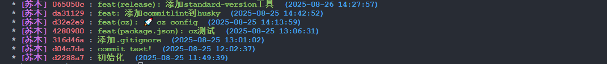
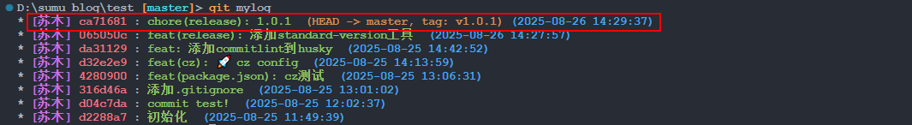
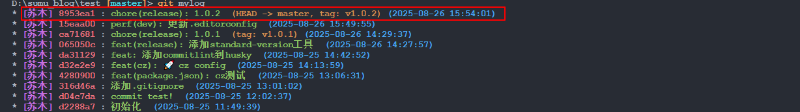

## 一、Standard-Version是什么

### 1. 简介

Standard-Version是一款遵循语义化版本（semver）和commit message标准规范的版本和Changelog自动化工具。它基于commit类型来自动更新版本号，例如新功能（feature）会更新次要版本号（minor），修复错误（bug fix）会更新补丁版本号（patch），而破坏性更改（BREAKING CHANGES）则会更新主要版本号（major）。这意味着开发者只需要专注于开发，而不需要担心版本号和Changelog的更新。

要使用Standard-Version，开发者需要遵循Conventional Commit Specifications来编写标准化的commit message。这些规范化的commit message不仅使代码提交更具可读性，还有助于生成准确和有用的Changelog。为了帮助开发者编写符合规范的commit message，可以使用如commitizen这样的工具。

### 2. 会做那些事？

在版本发布过程中，Standard-Version会自动完成以下工作：

（1）根据package.json中的版本号自动更新版本号。

（2）自动生成和更新Changelog，包括新增的功能、修复的bug、破坏性更改等详细信息。

（3）使用git tag为新的版本打上标签，方便后续的版本追踪和管理。

### 3. 相关依赖

在使用之前需要先安装：

```bash
npm i -D standard-version
```

> [GitHub - conventional-changelog/standard-version: :trophy: Automate versioning and CHANGELOG generation, with semver.org and conventionalcommits.org](https://github.com/conventional-changelog/standard-version)

## 二、基本用法与配置

### 1. 基本用法

在package.json添加以下命令：

```json
{
  //...
  "scripts": {
    //...
    "release": "standard-version",
    "release-major": "standard-version --release-as major",
    "release-minor": "standard-version --release-as minor",
    "release-patch": "standard-version --release-as patch",
    "release-as": "standard-version --release-as",
    "release-prerelease": "standard-version --prerelease"
  }
  //...
}
```

以当前版本 "1.4.5" 为例，各命令执行后的版本变化：

| 命令                         | 版本变化              | 说明                                                                                                                                                                                                                           |
| ---------------------------- | --------------------- | ------------------------------------------------------------------------------------------------------------------------------------------------------------------------------------------------------------------------------ |
| `npm run release`            | 1.4.6 → 1.5.0 → 2.0.0 | 根据提交历史自动确定版本类型并创建标签：<br>- 如果有 `feat` 类型的提交，升级 minor 版本 (1.4.5 → 1.5.0)<br>- 如果有破坏性变更，升级 major 版本 (1.4.5 → 2.0.0)<br>- 如果只有 `fix` 类型的提交，升级 patch 版本 (1.4.5 → 1.4.6) |
| `npm run release-major`      | 1.4.5 → 2.0.0         | 强制升级主版本号，不分析提交历史中的变更类型来决定版本升级幅度，创建标签                                                                                                                                                       |
| `npm run release-minor`      | 1.4.5 → 1.5.0         | 强制升级次版本号，不分析提交历史中的变更类型来决定版本升级幅度，创建标签                                                                                                                                                       |
| `npm run release-patch`      | 1.4.5 → 1.4.6         | 强制升级补丁版本号，不分析提交历史中的变更类型来决定版本升级幅度，创建标签                                                                                                                                                     |
| `npm run release-as`         | 1.4.5 → 1.4.6         | 等同于 `--release-as patch`，强制升级补丁版本号，创建标签                                                                                                                                                                      |
| `npm run release-prerelease` | 1.4.5 → 1.4.6-alpha.0 | 创建预发布版本，默认使用 alpha 标识符，如果已存在 alpha.0 则会创建 alpha.1，创建标签                                                                                                                                           |

### 2. 配置文件

#### 2.1 `.versionrc`

配置文件位于可以是`.versionrc`, `.versionrc.json` or `.versionrc.js`，一般还是用`.versionrc`：

```json
{
  "types": [
    { "type": "feat", "section": "Features", "hidden": false },
    { "type": "fix", "section": "Bug Fixes", "hidden": false },
    { "type": "docs", "section": "Docs", "hidden": false },
    { "type": "style", "section": "Styling", "hidden": false },
    { "type": "refactor", "section": "Code Refactoring", "hidden": false },
    { "type": "perf", "section": "Performance Improvements", "hidden": false },
    { "type": "test", "section": "Tests", "hidden": false },
    { "type": "build", "section": "Build System", "hidden": false },
    { "type": "ci", "section": "CI", "hidden": false },
    { "type": "chore", "section": "Others", "hidden": false },
    { "type": "revert", "section": "Reverts", "hidden": false }
  ]
}
```

`.versionrc` 配置文件用于自定义 standard-version 的行为，主要控制 CHANGELOG.md 的生成方式和格式。其中：

- `type`: 提交信息的类型（如 feat、fix、docs 等），对应 Conventional Commits 规范中的提交类型
- `section`: 在 CHANGELOG.md 中显示的章节名称
- `hidden`: 是否在 CHANGELOG.md 中隐藏该类型的提交（false=显示，true=隐藏）

#### 2.2 版本升级影响

- `feat` 类型的提交会触发 minor 版本升级（如 1.4.5 → 1.5.0）
- `fix` 类型的提交会触发 patch 版本升级（如 1.4.5 → 1.4.6）
- 包含 `BREAKING CHANGE` 的提交会触发 major 版本升级（如 1.4.5 → 2.0.0）
- 其他类型（docs、style、refactor、perf、test、build、ci、chore、revert）不会触发版本升级，但会记录在 CHANGELOG.md 中

#### 2.3 自定义配置

##### 2.3.1 hidden

如果希望隐藏某些类型的提交，可以将 `hidden` 设置为 `true`：

```json
{ "type": "chore", "section": "Others", "hidden": true }
```

这样 `chore` 类型的提交就不会出现在 CHANGELOG.md 中。

##### 2.3.2 skip

> [standard-version/README.md at master · conventional-changelog/standard-version · GitHub](https://github.com/conventional-changelog/standard-version/blob/master/README.md#skipping-lifecycle-steps)

我们可以跳过任何生命周期步骤（' bump ', ' changelog ', ' commit ', ' tag '），通过在package.json中添加以下内容：

```json
{
  "standard-version": {
    "skip": {
      "changelog": true
    }
  }
}
```

当然也可以添加到`.versionrc`中：

```json
{
  //...
  "skip": {
    "tag": true
  }
  //...
}
```

像这里，就配置了跳过打tag的步骤，因为我在GithubAction中发布时会自动打tag并创建release，这个时候本地打了tag的话就会冲突了。

##### 2.3.3 message

```json
"message": "chore(release): {{currentTag}} [publish]",
```

messagez配置可以自定义提交记录的格式，像这里，我配置了publish标识，这是因为我的GithubAction配置为检测到提交中含有这个关键词就会触发。

##### 2.3.4 自定义版本文件处理

Standard-Version 支持自定义配置来处理非标准的版本文件。通过 `bumpFiles` 配置和自定义 `updater`，可以让 Standard-Version 自动处理任意格式的版本文件，确保在版本发布时所有相关文件都能同步更新。

Standard-Version 的 `bumpFiles` 配置用于指定需要更新版本号的文件。默认情况下，它只能处理 JSON 格式的文件（如 `package.json`），但通过自定义 `updater`，我们可以扩展其功能来处理任意格式的文件。

（1）创建自定义 updater：创建一个 JavaScript 模块，实现 `readVersion` 和 `writeVersion` 两个方法

- `readVersion(contents)`：从文件内容中解析出版本号
- `writeVersion(contents, version)`：将新版本号写入文件内容

（2）配置 .versionrc：在配置文件中添加 `bumpFiles` 配置，指定要处理的文件和对应的 updater

**使用示例：处理 TypeScript 版本文件**

假设我们有一个 `packages/mist/version.ts` 文件，内容为：

```typescript
export const version = "1.0.7";
```

（1）步骤 1：创建自定义 updater

```javascript
// build/scripts/version-updater.js
module.exports.readVersion = function (contents) {
  // 从 export const version = "1.0.7"; 中提取版本号
  const match = contents.match(/export const version = "([^"]+)";/);
  return match ? match[1] : null;
};

module.exports.writeVersion = function (contents, version) {
  // 更新版本号，保持原有格式
  return contents.replace(/export const version = "[^"]+";/, `export const version = "${version}";`);
};
```

（2）步骤 2：配置 .versionrc

```json
{
  "types": [...],
  "skip": {
    "tag": true
  },
  "message": "chore(release): {{currentTag}} [publish]",
  "bumpFiles": [
	{
      "filename": "package.json",
      "type": "json"
    },
    {
      "filename": "packages/mist/version.ts",
      "updater": "build/scripts/version-updater.js"
    }
  ]
}

```

需要注意，这里配置之后，就只会更新`packages/mist/version.ts`了，package.json就不会在更新，需要吧package.json也添加进去：

```json

```

#### 2.4 GitHub 链接配置

Standard-Version 默认情况下好像是可以自动生成的，例如

我配置的remote链接为：

```bash
D:\sumu_blog\test [master]> git remote -v
origin  git@gitee.com:sumumm/sumumm.git (fetch)
origin  git@gitee.com:sumumm/sumumm.git (push)
```

生成的文件中就是这样的：

```markdown
- 添加commitlint到husky ([da31129](https://gitee.com/sumumm/sumumm/commit/da311297db3e2b4aeea942c178be37f50843195c))
```

此外，Standard-Version 还支持自动生成版本比较链接，格式为：

```markdown
## [1.0.0](https://github.com/owner/repo/compare/v0.0.0...v1.0.0) (2024-01-15)
```

这些链接会自动指向 GitHub 仓库中对应版本之间的代码差异比较页面。

## 三、提交规范

### 1. 提交信息规范

必须遵循 Conventional Commits 规范：

```markdown
<type>(<scope>): <subject>

[optional body]

[optional footer(s)]
```

可以通过[cz-git](https://github.com/Zhengqbbb/cz-git)、[lint-staged](https://github.com/lint-staged/lint-staged)和[commitlint](https://github.com/conventional-changelog/commitlint)等工具来规范提交格式。

### 2. 提交示例

（1）`feat(button): add new primary button variant`

（2）`fix(modal): resolve overlay click issue`

（3）`docs(readme): update installation instructions`

## 四、工作流程详解

Standard-Version 的工作流程是一个完整的自动化发布过程，具体步骤如下：

### 1. 准备工作阶段

（1）**代码提交**：确保所有要包含在新版本中的更改都已提交到 Git 仓库

```bash
git add .
git commit -m "feat: 添加新功能"
git commit -m "fix: 修复问题"
```

（2）**检查提交规范**：确认所有提交都遵循 Conventional Commits 规范，这将直接影响版本号的升级幅度和变更日志的内容

### 2. 执行发布命令

（3）**运行 Standard-Version**：根据需求选择适当的命令

```bash
# 自动根据提交历史确定版本类型
npm run release

# 强制指定版本升级类型
npm run release-major    # 主版本升级 (1.4.5 → 2.0.0)
npm run release-minor    # 次版本升级 (1.4.5 → 1.5.0)
npm run release-patch    # 补丁版本升级 (1.4.5 → 1.4.6)
npm run release-prerelease   # 预发布版本 (1.4.5 → 1.4.6-alpha.0)
```

### 3. 自动化处理过程

（4）**版本分析**：Standard-Version 分析 Git 提交历史，根据提交类型确定版本升级幅度

- `feat` 类型的提交 → 触发 minor 版本升级
- `fix` 类型的提交 → 触发 patch 版本升级
- 包含 `BREAKING CHANGE` 的提交 → 触发 major 版本升级

（5）**文件更新**：工具自动执行以下操作

- **更新版本号**：修改 package.json 中的版本字段
- **生成变更日志**：创建/更新 CHANGELOG.md 文件，包含新版本的所有变更
- **更新锁文件**：如果存在 package-lock.json 或 pnpm-lock.yaml，更新其中的版本号

（6）**Git 操作**：

- **暂存文件**：自动执行 `git add` 命令，暂存以下被修改的文件：
  - `CHANGELOG.md`：新生成的变更日志文件
  - `package.json`：更新了版本号的配置文件
  - `package-lock.json` 或 `pnpm-lock.yaml`：如果存在，会更新依赖版本
  - 其他在 `.versionrc` 中配置的 `bumpFiles` 指定的文件
- **创建提交**：自动创建格式为 `chore(release): x.x.x` 的提交记录，提交消息包含新版本的变更摘要
- **打标签**：创建 Git 标签（默认格式为 `vx.x.x`）

### 4. 后续操作

（7）**推送到远程仓库**：

```bash
git push --follow-tags origin main
```

`--follow-tags` 参数会推送所有相关的标签到远程仓库

（8）**发布到 npm（可选）**：

```bash
npm publish
```

### 5. 完整流程示例

```bash
# 1. 开发并提交代码
git add .
git commit -m "feat: 添加用户登录功能"
git commit -m "fix: 修复按钮样式问题"

# 2. 运行 standard-version
npm run release

# 3. 查看生成的变更
git log --oneline -3
# 输出示例：
# a1b2c3d chore(release): 1.5.0
# d4e5f6g feat: 添加用户登录功能
# e7f8g9h fix: 修复按钮样式问题

# 4. 推送到远程
git push --follow-tags origin main
```

### 6. 注意事项

- **确保干净的工作目录**：运行前没有未提交的更改
- **提交规范的重要性**：正确的提交消息格式直接影响版本升级和变更日志内容
- **标签管理**：Git 标签用于标记发布版本，便于版本回退和追踪
- **自动化优势**：整个过程无需手动修改版本号或编写变更日志，减少人为错误

## 五、提交记录格式

Standard-Version 生成的提交记录格式遵循 Conventional Commits 规范，默认格式为：

```markdown
chore(release): <version>

<changelog-content>
```

具体示例如下

```markdown
chore(release): 1.2.0

feat(button): add new primary button variant
fix(modal): resolve overlay click issue
```

可以通过 `.versionrc` 配置文件自定义提交格式：

```json
{
  "types": [...],
  "commitAll": true,
  "commitMessage": "chore(release): {{currentTag}}",
  "skip": {
    "commit": false,
    "tag": false
  }
}
```

（1）`commitAll`: 是否提交所有未暂存的更改（默认：false）

（2）`commitMessage`: 自定义提交消息格式，支持 `{{currentTag}}` 等变量

（3）`skip.commit`: 设置为 true 可禁用自动提交

（4）`skip.tag`: 设置为 true 可禁用自动创建标签

（5）`tagPrefix`: 自定义标签前缀（默认：'v'）

## 六、生成格式示例

### 1. 一般格式示例

- 初始状态（首次运行前）：

```markdown
# CHANGELOG.md

所有重要的项目变更都会记录在此文件中。
```

- 第一次运行后（版本 1.0.0）：

```markdown
# CHANGELOG.md

所有重要的项目变更都会记录在此文件中。

## [1.0.0](https://github.com/owner/repo/compare/v0.0.0...v1.0.0) (2024-01-15)

### Features

- **button**: add new primary button variant (a1b2c3d)

### Bug Fixes

- **modal**: resolve overlay click issue (d4e5f6g)
```

- 第二次运行后（版本1.0.1）：

```markdown
# CHANGELOG.md

所有重要的项目变更都会记录在此文件中。

## [1.0.1](https://github.com/owner/repo/compare/v1.0.0...v1.0.1) (2024-01-16)

### Bug Fixes

- **button**: fix button styling issue (e3f4g5h)

## [1.0.0](https://github.com/owner/repo/compare/v0.0.0...v1.0.0) (2024-01-15)

### Features

- **button**: add new primary button variant (a1b2c3d)

### Bug Fixes

- **modal**: resolve overlay click issue (d4e5f6g)
```

### 2. 文件处理

- **会覆盖已有内容吗**？

Standard-Version **不会覆盖** CHANGELOG.md 文件中的已有内容，采用**追加模式**，将新的版本信息添加到文件的开头位置，保留所有历史版本的变更记录，确保完整的版本历史可追溯。

- **文件写入位置**：

新版本信息会插入到文件的最开头，在标题和文件描述之后。历史版本信息自动下延，保持时间倒序排列（最新版本在最前面）。文件结构保持原有的整体结构，只添加新的版本块。

- **空文件？**

如果 CHANGELOG.md 文件不存在，Standard-Version 会自动创建，如果文件存在但为空，会添加基本的项目变更记录描述，确保文件始终包含有意义的版本历史信息

### 3. 使用示例

之前有过一个测试仓库，有如下提交：



执行完`npm run release-patch`命令，提交记录如下：



最后生成的CHANGELOG.md为：

```markdown
# Changelog

All notable changes to this project will be documented in this file. See [standard-version](https://github.com/conventional-changelog/standard-version) for commit guidelines.

### 1.0.1 (2025-08-26)

### Features

- 添加commitlint到husky ([da31129](https://gitee.com/sumumm/sumumm/commit/da311297db3e2b4aeea942c178be37f50843195c))
- **cz:** 🚀 cz config ([d32e2e9](https://gitee.com/sumumm/sumumm/commit/d32e2e930b61d57384cba99d4949758645404b4d))
- **package.json:** cz测试 ([4280900](https://gitee.com/sumumm/sumumm/commit/42809008b7147aa024b701c264cdccd6b0dfc84a))
- **release:** 添加standard-version工具 ([065050c](https://gitee.com/sumumm/sumumm/commit/065050cf911530d7569b6bc048bec91675d75626))
```

若是再进行一次提交，然后运行`npm run release-patch`，文件会变成这样：

```markdown
# Changelog

All notable changes to this project will be documented in this file. See [standard-version](https://github.com/conventional-changelog/standard-version) for commit guidelines.

### [1.0.2](https://gitee.com/sumumm/sumumm/compare/v1.0.1...v1.0.2) (2025-08-26)

### Performance Improvements

- **dev:** 更新.editorconfig ([15eaa00](https://gitee.com/sumumm/sumumm/commit/15eaa00976c14f4817b8513208c276d99f0f9ee2))

### 1.0.1 (2025-08-26)

### Features

- 添加commitlint到husky ([da31129](https://gitee.com/sumumm/sumumm/commit/da311297db3e2b4aeea942c178be37f50843195c))
- **cz:** 🚀 cz config ([d32e2e9](https://gitee.com/sumumm/sumumm/commit/d32e2e930b61d57384cba99d4949758645404b4d))
- **package.json:** cz测试 ([4280900](https://gitee.com/sumumm/sumumm/commit/42809008b7147aa024b701c264cdccd6b0dfc84a))
- **release:** 添加standard-version工具 ([065050c](https://gitee.com/sumumm/sumumm/commit/065050cf911530d7569b6bc048bec91675d75626))
```

完整的提交记录如下：



## 七、Standard-Version 适用场景

（1）项目遵循 Conventional Commits 规范

（2）希望完全自动化发布流程

（3）单包项目或简单的版本管理

（4）团队习惯使用规范的提交消息

## 八、故障排除

### 1. 常见问题与调试技巧

（1）**提交历史不规范**：使用 `cz-git` 工具确保格式正确，配置 Git hooks 自动验证

### 2. 通用调试技巧

（1）使用 `--verbose` 标志获取详细输出

（2）检查生成的 CHANGELOG.md 文件内容

（3）验证 Git 标签是否正确创建
