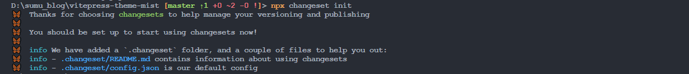
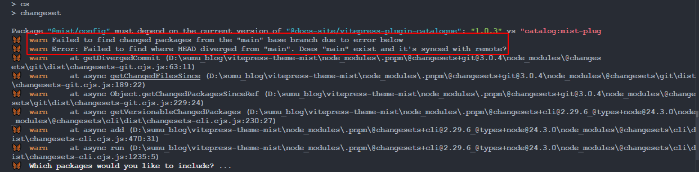
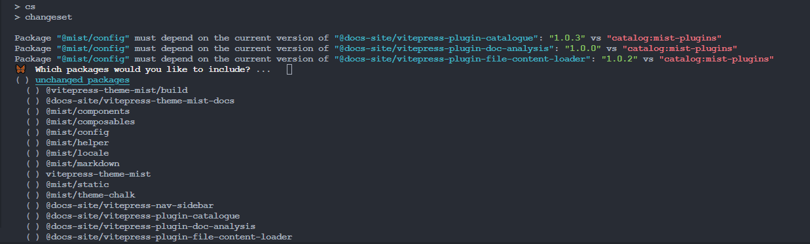
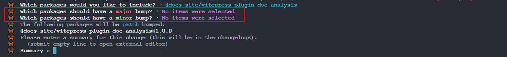
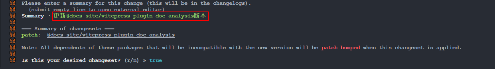
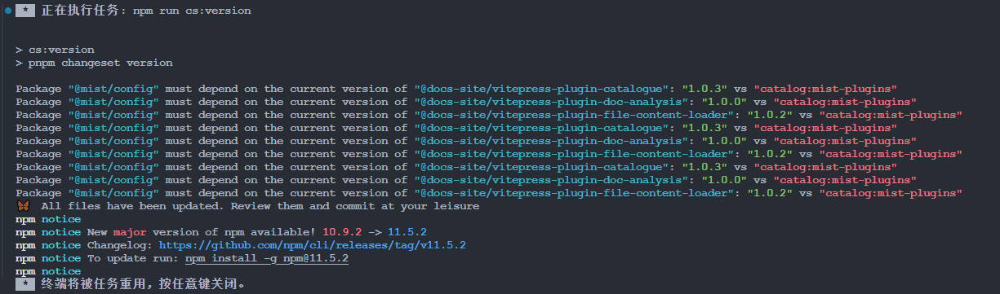

## 一、Changesets是什么

### 1. 简介

Changesets 是一个专为 monorepo 项目设计的版本管理和变更日志生成工具。与 Standard-Version 不同，Changesets 采用手动创建变更集（changeset）的方式，让开发者能够精确控制每个版本包含的变更内容。它特别适合多包管理的复杂项目，提供更灵活的版本控制策略。

Changesets 的核心思想是"变更集驱动"——开发者需要手动创建变更集文件来描述所做的更改，然后工具会根据这些变更集自动更新版本号、生成变更日志，并处理包之间的依赖关系。

**核心特点**：

- 在开发时，需要开发者提供本次变更涉及的包名称、升级版本类型（`patch`、`minor`、`major`）及变更信息
- 在发布版本时，会根据变更集自动升级对应包的版本号，并在对应的包中生成 `Changelog` 信息
- 在 `Monorepo` 场景中，会自动生成仓库依赖图，升级时只会升级变更包及相关依赖包的版本号

### 2. 会做那些事？

在版本发布过程中，Changesets 会自动完成以下工作：

（1）**管理变更集**：创建和管理 `.changeset` 目录下的变更集文件

（2）**版本更新**：根据变更集内容自动更新各个包的版本号

（3）**生成变更日志**：自动生成和更新 CHANGELOG.md 文件

（4）**依赖管理**：处理 monorepo 中包之间的依赖关系更新

（5）**发布管理**：支持预发布模式和正式发布流程

### 3. 相关依赖

在使用之前需要先安装：

```bash
npm install -D @changesets/cli
# 或者使用 pnpm
pnpm add -D @changesets/cli
```

> [GitHub - changesets/changesets: 🦋 A way to manage your versioning and changelogs with a focus on monorepos](https://github.com/changesets/changesets)

初始化 Changesets：

```bash
npx changeset init
```



初始化完会自动生成两个文件：

```bash
test
├── .changeset
│   ├── config.json
│   └── README.md
└── ...
```

## 二、基本用法与配置

### 1. 基本用法

在 package.json 中添加以下命令：

```json
{
  "scripts": {
    "cs": "changeset",
    "cs:version": "changeset version",
    "cs:release": "changeset publish",
    "cs:pre": "changeset pre enter",
    "cs:pre:exit": "changeset pre exit"
  }
}
```

**脚本命令详细说明：**

#### 1.1 `cs` (`changeset`): 交互式创建变更集文件

##### 1.1.1 功能描述

启动交互式命令行界面，引导开发者创建变更集文件。该命令会逐步询问以下信息：

- 选择受影响的包（在 monorepo 中会列出所有可用包）
- 选择变更类型（major/minor/patch）
- 填写变更描述信息

##### 1.1.2 工作流程

（1）运行命令后，会显示当前工作区中的所有包列表

> **包列表来源**：Changesets 会自动扫描工作区中的 `package.json` 文件，根据以下规则确定要显示的包：
>
> - 在 monorepo 中，会读取 `pnpm-workspace.yaml` 或 `lerna.json` 配置的工作区范围
> - 识别所有包含有效 `name` 和 `version` 字段的 `package.json` 文件
> - 排除标记为 `private: true` 的私有包
> - 默认情况下会显示所有可发布的公共包

（2）使用空格键选择受影响的包（可多选）

（3）为每个选中的包选择版本变更类型

（4）输入详细的变更描述（支持多行 Markdown 格式）

（5）确认后会在 `.changeset` 目录下生成新的变更集文件

##### 1.1.3 生成文件

在 `.changeset` 目录下创建随机命名的 Markdown 文件，格式为：

```markdown
---
"package-name": patch/minor/major
---

变更描述内容...
```

##### 1.1.4 注意事项

- 变更集文件需要提交到版本控制中
- 描述信息应该清晰详细，便于后续生成变更日志
- 可以多次运行此命令为不同的变更创建多个变更集

#### 1.2 `cs:version` (`changeset version`): 根据变更集更新版本号

##### 1.2.1 功能描述

读取所有未处理的变更集文件，自动执行以下操作：

- 更新相关包的版本号（根据变更集中指定的类型）
- 生成或更新 CHANGELOG.md 文件
- 删除已处理的变更集文件

##### 1.2.2 工作流程

（1）扫描 `.changeset` 目录下的所有变更集文件

（2）解析每个文件中的包名和版本变更类型

（3）按照 semver 规范更新 package.json 中的版本号

（4）在对应包的目录中生成/更新 CHANGELOG.md 文件

（5）删除已处理的变更集文件

##### 1.2.3 影响范围

- 修改 package.json 文件中的版本号
- 创建或更新 CHANGELOG.md 文件
- 更新包之间的依赖关系版本号

##### 1.2.4 注意事项

- 此命令会修改文件，建议先提交当前更改
- 变更日志的格式可以通过配置文件自定义
- 对于 monorepo，会自动处理包间的依赖版本更新

#### 1.3 `cs:release` (`changeset publish`): 发布包到 npm 注册表

##### 1.3.1 功能描述

发布所有版本号已更新但尚未发布的包到 npm 注册表。

##### 1.3.2 发布机制

（1）**版本检查**：对比本地包版本和 npm 上的已发布版本

（2）**发布条件**：只发布满足以下条件的包：

- 版本号比 npm 上更新的包（本地版本 > 远程版本）
- 新包（从未发布过的包）
- 非私有包（`private` 不为 `true`）

（3）**依赖处理**：确保依赖关系正确发布

> **前置要求：**
>
> - 需要先登录 npm：`npm login`
> - 具有对应包的发布权限
> - 网络连接正常

##### 1.3.3 发布流程

（1）检查每个包的发布状态

（2）构建包（如果配置了构建脚本）

（3）发布到 npm 注册表

（4）更新发布状态信息

##### 1.3.4 注意事项

- 对于 `@scope/package` 形式的包，默认需要组织权限
- 可以通过 `publishConfig.access` 配置发布权限
- 发布前建议先进行本地测试

#### 1.4 `cs:pre` (`changeset pre enter`): 进入预发布模式

##### 1.4.1 功能描述

切换到预发布状态，后续的版本号会添加预发布标识（如 alpha、beta、rc）。

适用场景如下：

- 功能开发完成，需要进行内部测试
- 重大变更需要收集用户反馈
- 发布候选版本进行最终验证

##### 1.4.2 使用方法

```bash
# 进入 alpha 预发布模式
pnpm cs:pre alpha

# 进入 beta 预发布模式
pnpm cs:pre beta

# 进入 rc 预发布模式
pnpm cs:pre rc
```

##### 1.4.3 执行效果

- 设置预发布状态标识
- 后续执行 `cs:version` 时，版本号会附加预发布标识
- 例如：`1.0.0` → `1.0.0-alpha.0` → `1.0.0-alpha.1`

##### 1.4.3 注意事项

- 预发布版本通常不建议用于生产环境
- 预发布模式可以随时退出并恢复正常发布流程

#### 1.5 `cs:pre:exit` (`changeset pre exit`): 退出预发布模式

##### 1.5.1 功能描述

结束预发布状态，恢复正常版本发布流程。

##### 1.5.2 执行效果

- 清除预发布状态标识
- 后续版本号恢复正常的 semver 格式
- 需要重新运行 `cs:version` 来生成正式版本

##### 1.5.3 退出流程

（1）运行 `cs:pre:exit` 退出预发布模式

（2）运行 `cs:version` 生成正式版本号

（3）运行 `cs:release` 发布正式版本

##### 1.5.4 注意事项

- 退出预发布模式后，预发布版本的变更集仍然有效
- 建议在退出前确保所有预发布版本的问题都已修复
- 退出后无法再发布相同版本的预发布包

### 2. 配置文件详解

配置文件位于 `.changeset/config.json`：

```json
{
  "$schema": "https://unpkg.com/@changesets/config@3.1.1/schema.json",
  "changelog": "@changesets/cli/changelog",
  "commit": false,
  "fixed": [],
  "linked": [],
  "access": "public",
  "baseBranch": "main",
  "updateInternalDependencies": "patch",
  "ignore": []
}
```

#### 2.1 `changelog`

变更日志生成器配置

- 设置为 `false` 时，执行 `version` 命令时，在 `CHANGELOG.md` 文件中只声明版本号，不声明其他 `Changelog` 信息
- 可以使用内置的 `@changesets/cli/changelog` 或自定义生成器

#### 2.2 `commit`

是否自动创建 Git 提交和打 tag

- 为 `true` 时，在执行 `change` 和 `version` 命令时，将自动执行以下操作：
  - 创建 Git 提交，提交消息格式为：`chore: update versions`
  - 为每个更新的包创建 Git tag，tag 格式为：`包名@版本号`（例如：`@mist/components@1.2.0`）
  - 自动推送提交和 tags 到远程仓库（如果配置了自动推送）
- 默认：`false`
- **注意**：自动提交功能需要配置 Git 用户信息，且在 CI/CD 环境中可能需要额外的权限配置

#### 2.3 `fixed`

用于 `monorepo` 中对包进行分组

- 相同分组中的包版本号将进行绑定，每次执行 `version` 命令时，同一分组中的包只要有一个升级版本号，其他会一起升级
- 支持使用正则匹配包名称

#### 2.4 `linked`

和 `fixed` 类似，也是对 `monorepo` 中对包进行分组

- 每次执行 `version` 命令时，只有和 `changeset` 声明的变更相关的包才会升级版本号
- 同一分组的变更包的版本号将保持一致
- 支持使用正则匹配包名称

#### 2.5 `access`

发布权限配置

- 如果配置为 `restricted`，将作为私有包发布
- 如果为 `public`，则发布公共范围包

> 对于仓库中存在部分包需要特殊配置 access，可以在 `package.json` 中配置 `publishConfig`：
>
> ```json
> {
>   "publishConfig": {
>     "registry": "https://registry.npmjs.org/",
>     "access": "public"
>   }
> }
> ```

#### 2.6 `baseBranch`

仓库主分支名称

- 该配置用于计算当前分支的变更包并进行分类
- 默认：`"main"`

这里要改成自己的仓库使用的分支，不然在使用的时候可能会有警告：



上图这里就是用分支是master，但是配置的main。

#### 2.7 `updateInternalDependencies`

用于声明更新内部依赖的版本号规则

- 当执行 `version` 命令升级版本号时，默认会自动更新仓库中使用该包的依赖声明
- 配置该字段为 `minor` 后，如果升级版本号为 `patch` 类型，将不会自动更新引用依赖声明

> 例如：当配置 `updateInternalDependencies` 为 `minor` 时，升级 `pkg-a` 至 `1.0.1` 时，`pkg-b` 中的 `pkg-a` 的依赖版本将不会更新，只有 `pkg-a` 升级版本号为 `1.1.0` 或者 `2.0.0` 时，才会更新 `pkg-b` 中的 `pkg-a` 的依赖。

#### 2.8 `ignore`

用于声明执行 version 命令时忽略的包

- 和 `version` 命令的 `--ignore` 参数用法一致，注意两者不能同时使用

### 3. 变更集文件格式

每个变更集是一个 Markdown 文件，位于 `.changeset` 目录下，格式如下：

```markdown
---
"package-name": patch
---

描述此次变更的内容，支持 Markdown 格式。

可以包含多行描述，详细说明变更的影响和原因。
```

一个变更集文件包含了在某个分支或者 `commit` 上改动信息，包括：

- 本次变更涉及哪些包的变更
- 本次变更需要升级的版本号类型，类型符合 [semver](https://peiyanlu.github.io/vite-press/npm/SemVer) 规范
- 本次变更的 `Changelog` 信息

这个文件的本质是对包的版本和 `Changelog` 做一个预存储，我们也可以在这些文件中修改信息。

**版本类型说明：**

- `major`: 重大变更，不向后兼容
- `minor`: 新增功能，向后兼容
- `patch`: Bug 修复，向后兼容

## 三、工作流程详解

Changesets 的工作流程是一个精确控制的发布过程，具体步骤如下：

### 1. 第一次发布

对于新项目的第一次发布，需要先构建并直接发布：

```bash
# 构建项目
pnpm run build

# 直接发布
pnpm changeset publish
```

- `@xxx/xx` 形式的包会被当作私有包，默认需要以组织的方式登录，可以通过参数发布为公共包：

```bash
pnpm publish --access public
```

- `changeset publish` 时指定参数不生效，此时可以在 `package.json` 中指定配置：

```json
{
  "publishConfig": {
    "access": "public"
  }
}
```

- 不需要发布的包可以在 `package.json` 中设置：

```json
{
  "private": true
}
```

### 2. 开发阶段

（1）**开发功能**：进行代码开发和修改

（2）**创建变更集**：运行 `pnpm cs` 命令创建变更集

```bash
pnpm cs
```

具体变更集创建过程可以看下一节。

### 3. 变更集创建过程

#### 3.1 模块工程方案

在根目录执行 `pnpm changeset`，选择本次变更需要升级的版本号类型，填入 `Changelog` 信息，并点击两次回车，执行完成后，将在项目的 `.changeset` 目录创建对应的变更集文件

#### 3.2 Monorepo 工程方案

在根目录执行 `pnpm changeset`，选择本次需要升级的包列表，分别选择不同版本类型对应的包，`changeset` 会询问版本号类型，如果存在包未选择这两种类型，将会默认使用 `patch` 类型，填入 `Changelog` 信息，并点击两次回车，执行完成后，将在项目的 `.changeset` 目录创建对应的变更集文件

- 假设现在要进行迭代，我们从主分支上切一个分支出来，完成代码修改，如果需要变更记录，执行 `pnpm changeset` 命令生成变更集文件，最后提交代码
- 变更集文件需要一并提交到远程仓库中。在后续的新版本发布后，这些变更集文件是会被自动消耗掉的

（3）**选择包**：交互式选择受影响的包

（4）**选择变更类型**：选择 major/minor/patch

（5）**填写描述**：详细描述变更内容

#### 3.3 使用实例

##### 3.3.1 选择要变更的包

我们按前面的初始化好Changesets，然后执行 pnpm cs命令，会有以下提示信息出现：



这里就会列出工作区所有的包，我们选择下面的`vitepress-plugin-doc-analysis`这个包，用方向键移动到这个包的位置，然后按下空格：


##### 3.3.2 选择变更类型

选择完包之后，Changesets会询问版本变更类型：



这里是从`major/minor/patch/`中让我们确认的，若是major需要更新patch编号，那么前两个就不要选择对应的包

> ```markdown
> patch (1.0.0 -> 1.0.1) Bug修复，向后兼容的小改动
> minor (1.0.0 -> 1.1.0) 新增功能，向后兼容的功能添加
> major (1.0.0 -> 2.0.0) 重大变更，不向后兼容的破坏性改动
> ```

我这里选择的就是更新patch，然后在下面填上描述信息：



这个信息最终将会在对应的CHANGELOG文件。然后最后选择true即可。

##### 3.3.3 生成变更集文件

就会在`.changeset`目录生成一个随机命名的变更集文档：

```markdown
---
"@docs-site/vitepress-plugin-doc-analysis": patch
---

更新@docs-site/vitepress-plugin-doc-analysis 版本
```

每次变更都会生成单独的变更集文档，同一个包的多个变更集文档最终会被合并起来。

### 4. 版本发布阶段

（6）**更新版本**：运行 `pnpm cs:version` 根据变更集更新版本

```bash
pnpm cs:version
```



运行完毕后就会在对应的包的目录生成一个CHANGELOG.md文档，同时`.changeset`目录的变更集文件会消失，然后就会发现package.json中版本号发生了变化。

（7）**检查变更**：查看生成的变更日志和版本更新

（8）**发布版本**：运行 `pnpm cs:release` 发布新版本

```bash
pnpm cs:release
```

`changeset` 会检查当前工作区中所有包的版本是否已经被发布过，如果没有则自动发布。

### 5. 预发布流程

#### 5.1 进入预发布模式

```bash
# 发布 alpha 版本
pnpm changeset pre enter alpha

# 发布 beta 版本
pnpm changeset pre enter beta

# 发布 rc 版本
pnpm changeset pre enter rc
```

#### 5.2 修改包的版本

```bash
pnpm changeset version
```

执行后包的版本发生变化，其他项目依赖此包的版本也相应发生变化

#### 5.3 发布测试版本

```bash
# 构建项目
pnpm run build

# 发布测试版本
pnpm changeset publish
```

#### 5.4 退出预发布模式

发布前退出预发布模式：

```bash
pnpm changeset pre exit
```

### 6. 正式发布流程

（1）**修改版本号**：

```bash
pnpm changeset version
```

（2）**发布正式版本**：

```bash
pnpm changeset publish
```

### 7. 完整流程示例

```bash
# 1. 开发并提交代码
git add .
git commit -m "feat: 添加新功能"

# 2. 创建变更集
pnpm cs
# 选择包: @mist/components
# 选择变更类型: minor
# 描述: 添加新的按钮组件变体

# 3. 更新版本
pnpm cs:version

# 4. 检查变更
git status
git diff

# 5. 提交版本更新
git add .
git commit -m "chore: update versions"

# 6. 发布
pnpm cs:release
```

## 四、变更集规范

### 1. 变更集文件规范

每个变更集文件必须包含：

- **Frontmatter**: 使用 YAML 格式指定包和变更类型
- **描述内容**: 详细描述变更内容，使用 Markdown 格式

### 2. 变更集示例

#### 2.1 示例 1：功能新增

```markdown
---
"@mist/components": minor
---

添加新的 PrimaryButton 组件，支持多种尺寸和主题变体。

- 支持 small/medium/large 三种尺寸
- 支持 primary/secondary 两种主题
- 添加完整的类型定义和文档
```

#### 2.2 示例 2：Bug 修复

```markdown
---
"@mist/utils": patch
---

修复日期格式化函数在处理闰年时的错误。

具体问题：2月29日格式化时会出现日期偏移，现已修复。
```

#### 2.3 示例 3：重大变更

```markdown
---
"@mist/core": major
---

重构事件系统，不再支持旧的事件监听方式。

**破坏性变更：**

- 移除 `on()` 方法，改为使用 `addEventListener()`
- 事件名称统一使用 camelCase 格式
- 需要更新所有使用事件监听的代码
```

## 五、生成格式示例

### 1. 一般格式示例

**变更集文件：**

```markdown
---
"@mist/components": minor
"@mist/utils": patch
---

添加新的模态框组件并修复工具函数中的日期处理问题。
```

**生成的 CHANGELOG.md：**

```markdown
# @mist/components

## 1.2.0

### Minor Changes

- 添加新的模态框组件 ([a1b2c3d](https://github.com/owner/repo/commit/a1b2c3d))

# @mist/utils

## 1.1.1

### Patch Changes

- 修复日期处理函数 ([d4e5f6g](https://github.com/owner/repo/commit/d4e5f6g))
- Updated dependencies [a1b2c3d]:
  - @mist/components@1.2.0
```

### 2. 多包协同示例

**多个相关变更集：**

```markdown
---
"@mist/core": minor
"@mist/components": minor
---

重构主题系统，所有组件支持新的主题配置。
```

**生成的变更日志会显示依赖关系：**

```markdown
# @mist/components

## 2.1.0

### Minor Changes

- 支持新的主题配置系统 ([e7f8g9h](https://github.com/owner/repo/commit/e7f8g9h))

### Patch Changes

- Updated dependencies [e7f8g9h]:
  - @mist/core@2.1.0
```

### 3. 文件处理机制

- **变更集文件位置**: 所有变更集文件存储在 `.changeset` 目录下
- **文件命名**: 使用随机生成的名称，如 `quick-lions-study.md`
- **文件清理**: 在 `changeset version` 执行后，已处理的变更集文件会被自动删除
- **版本追踪**: 每个变更集都会生成对应的 Git 提交哈希链接

## 六、Changesets 适用场景

### 1. 主要适用场景

（1）**Monorepo 项目**：多包管理的复杂项目结构

（2）**精确版本控制**：需要手动审核每个变更的场景

（3）**团队协作**：多个开发者同时修改不同包的项目

（4）**复杂依赖关系**：包之间存在复杂的依赖关系需要协调

（5）**预发布管理**：需要灵活的预发布和测试流程

### 2. 与 Standard-Version 对比

| 特性     | Changesets       | Standard-Version     |
| -------- | ---------------- | -------------------- |
| 适用项目 | Monorepo         | 单包项目             |
| 变更控制 | 手动创建变更集   | 自动分析提交历史     |
| 版本策略 | 精确控制每个变更 | 基于提交类型自动决定 |
| 工作流程 | 变更集驱动       | 提交历史驱动         |
| 学习曲线 | 较高             | 较低                 |
| 灵活性   | 高               | 中等                 |

## 七、故障排除

### 1. 常见问题与解决方案

**问题 1：变更集文件未被识别**

- 原因：文件格式不正确或位置错误
- 解决：确保变更集文件在 `.changeset` 目录下，且格式正确

**问题 2：版本更新失败**

- 原因：包名配置错误或权限问题
- 解决：检查 `package.json` 中的包名和访问权限

**问题 3：依赖关系未正确更新**

- 原因：`updateInternalDependencies` 配置不当
- 解决：调整配置为 `patch` 或 `minor`

**问题 4：发布权限问题**

- 原因：`@xxx/xx` 形式的包被当作私有包
- 解决：在 `package.json` 中配置 `publishConfig.access: "public"`

### 2. 调试技巧

（1）使用 `--verbose` 标志获取详细输出：

```bash
pnpm cs:version --verbose
```

（2）检查变更集文件格式是否正确

（3）验证包名和版本号配置

（4）查看生成的 CHANGELOG.md 文件内容

（5）检查 Git 状态确认所有文件已正确提交

### 3. 最佳实践

（1）**及时创建变更集**：在完成功能开发后立即创建变更集

（2）**详细描述变更**：在变更集中提供足够详细的信息

（3）**定期清理变更集**：确保已处理的变更集文件被正确清理

（4）**测试预发布版本**：充分利用预发布功能进行测试

（5）**团队协作规范**：建立团队内的变更集创建和审核流程

（6）**权限配置**：对于需要特殊权限的包，在 `package.json` 中正确配置 `publishConfig`

## 八、高级配置

### 1. 自定义变更日志生成器

可以创建自定义的变更日志生成器：

```javascript
// .changeset/changelog-config.js
module.exports = {
  getReleaseLine: async (changeset, type) => {
    // 自定义变更日志行格式
  },
  getDependencyReleaseLine: async (changeset, dependencyChanges) => {
    // 自定义依赖变更行格式
  },
};
```

### 2. GitHub Actions 集成

可以配置 GitHub Actions 自动化发布流程：

```yaml
name: Release
on:
  push:
    branches: [main]
jobs:
  release:
    runs-on: ubuntu-latest
    steps:
      - uses: actions/checkout@v4
      - uses: pnpm/action-setup@v2
      - uses: actions/setup-node@v4
      - run: pnpm install
      - run: pnpm cs:version
      - run: pnpm cs:release
```

### 3. 版本策略配置

根据项目需求调整版本更新策略：

```json
{
  "updateInternalDependencies": "minor",
  "___experimentalUnsafeOptions_WILL_CHANGE_IN_PATCH": {
    "onlyUpdatePeerDependentsWhenOutOfRange": true
  }
}
```

通过合理的配置和使用，Changesets 可以成为 monorepo 项目版本管理的强大工具，提供精确的版本控制和灵活的发布流程。
