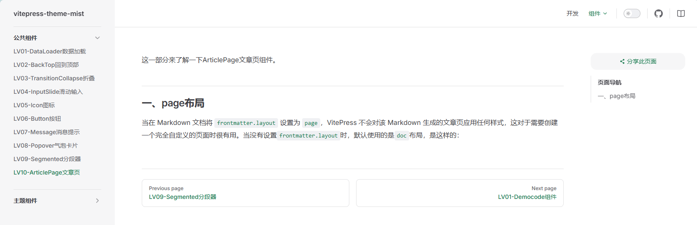
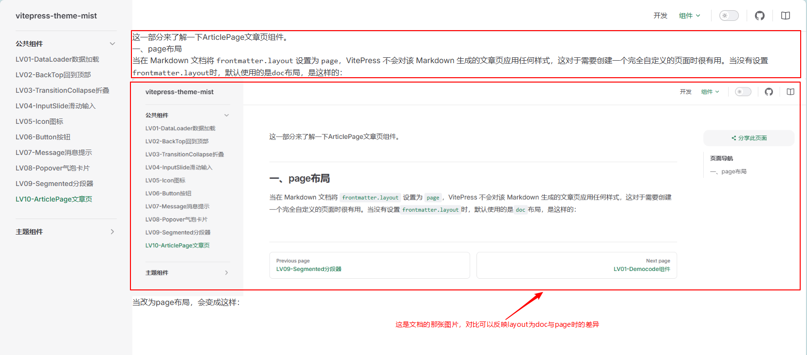

这一部分来了解一下ArticlePage文章页组件。

<!-- more -->

<script setup>
import { MtArticlePage } from "vitepress-theme-mist"
</script>

## 一、page布局

当在 Markdown 文档将 `frontmatter.layout` 设置为 `page`，VitePress 不会对该 Markdown 生成的文章页应用任何样式，这对于需要创建一个完全自定义的页面时很有用。当没有设置`frontmatter.layout`时，默认使用的是`doc`布局，是这样的：



当改为page布局，会变成这样：



## 二、文章页组件应用

### 1. 基础用法

::: demo 构建一个基础的文章页框架
articlePage/basic
:::

### 2. 使用doc配置项

此组件可以使用 doc 配置项来加载 VitePress 的默认文档样式。

::: demo

```yaml
effect: articlePage/doc-iframe
file: articlePage/doc
```

:::

在这个示例中：
- `articlePage/doc-iframe.vue` 是用于在文档中展示效果的 iframe 组件，它使用了 VitePress 的 `withBase` 函数来正确处理基础路径，显示的效果是layout为false的`articlePage/doc.md`文档中使用`<MtArticlePage doc />`组件的效果。

- `articlePage/doc.vue` 是展示`<MtArticlePage doc />`的语法源码文件，effect的`articlePage/doc-iframe`文件是Democode的效果展示，file是Democode中的源码展示。

### 3. 大纲栏

::: demo 当存在 h1 到 h6 标题标签时，可以使用 `aside` 配置项来自动生成一个大纲栏。

```yaml
effect: articlePage/aside-iframe
file: articlePage/aside
```

:::

## API

### 配置项

| 名称  | 说明                                    | 类型      | 默认值 |
| :---- | :-------------------------------------- | :-------- | :----- |
| doc   | 是否是文档页（使用 VitePress 文档样式） | `boolean` | false  |
| aside | 是否使用大纲栏                          | `boolean` | false  |

使用 `aside` 配置项的前提是要有 `h1` 到 `h6` 标题标签，且标题标签里要有 `a` 标签，如：

```vue
<script setup lang="ts">
import { MtArticlePage } from "vitepress-theme-teek";
</script>

<template>
  <MtArticlePage doc aside>
    <h1 id="一级标题">
      一级标题
      <a class="header-anchor" href="#一级标题" aria-label="Permalink to '一级标题'" />
    </h1>
    <h2 id="二级标题">
      二级标题
      <a class="header-anchor" href="#二级标题" aria-label="Permalink to '二级标题'" />
    </h2>
    <p>VitePress-theme-mist</p>
  </MtArticlePage>
</template>
```

