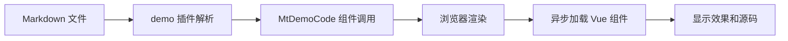

## 一、概述

本文档深入分析 VitePress 主题中的 `demo` 插件 (`packages/markdown/plugins/demo.ts`) 和 `MtDemoCode` 组件 (`packages/components/theme/DemoCode/src/index.vue`)。这两个组件协同工作，实现在 Markdown 文档中嵌入可交互的 Vue 组件示例，并提供源代码查看、复制等功能。

## 二、工作原理总览

整个流程可以分为以下几个步骤：

（1）**Markdown 解析阶段**：VitePress 使用 `demo` 插件解析 Markdown 中的 `:::demo` 容器块
（2）**组件生成阶段**：插件读取指定的 Vue 文件，生成 `MtDemoCode` 组件调用
（3）**运行时渲染阶段**：浏览器渲染页面时，`MtDemoCode` 组件异步加载并渲染实际的 Vue 组件



## 三、demo 插件分析

### 1. 功能说明

`demo` 插件是一个基于 [markdown-it-container](https://github.com/markdown-it/markdown-it-container) 的自定义 Markdown 插件，用于解析特定格式的 Markdown 容器块（以 `:::demo` 开头），并将其转换为 `MtDemoCode` 组件调用。

### 2. 实现原理

#### 2.1 插件注册

插件通过 `md.use(container, "demo", options)` 注册了一个名为 `demo` 的容器标签处理器。

#### 2.2 参数验证

```ts
validate(params) {
  return !!params.trim().match(/^demo\s*(.*)$/);
}
```

此函数用于验证容器标签是否符合 `:::demo` 格式，允许带有额外描述文本。

#### 2.3 渲染逻辑

当遇到 `:::demo` 容器时，插件会执行以下操作：

（1）**提取描述信息**：

```ts
const desc = tokens[idx].info.trim().match(/^demo\s*(.*)$/);
let description = desc && desc.length > 1 ? desc[1].trim() : "";
const effect = description.startsWith("effect");
if (effect) description = description.replace("effect", "").trim();
```

（2）**获取源文件路径**：

```ts
const sourceFileToken = tokens[idx + 2];
const yamlToken = tokens[idx + 1];
const { sourceFile, effectPath } = getDemoFile(sourceFileToken, yamlToken);
```

（3）**读取源文件内容**：

```ts
let source = "";
if (sourceFile) source = readFileSync(resolve(demoPath, sourceFile), "utf-8");
if (!source) throw new Error(`Incorrect source file path: ${sourceFile}`);
```

（4）**生成 MtDemoCode 组件调用**：

```ts
if (tokens[idx].nesting === 1 /* 标签打开 */) {
  return `<TkDemoCode effect="${effect}" source="${encodeURIComponent(
    md.render(`\`\`\` vue\n${source}\`\`\``)
  )}" path="${posix.join(path, effectPath)}" raw-source="${encodeURIComponent(
    source
  )}" description="${encodeURIComponent(md.render(description))}" options="${encodeURIComponent(JSON.stringify(option))}">`;
} else return "</TkDemoCode>";
```

需要注意的是，demo 插件是一个相对独立的插件，它不依赖于 `packages/markdown` 目录中的其他插件或辅助函数。它直接使用了以下外部依赖：

- `markdown-it-container`：用于创建 Markdown 容器
- `js-yaml`：用于解析 YAML 格式的配置
- Node.js 内置模块 `fs` 和 `path`：用于读取文件和处理路径

在 `packages/config/index.ts` 中还有这样一段代码：

```ts
// 创建用户配置的自定义容器
createContainersThenUse(md, container.config?.() || []);
```

需要注意的是，这段代码与 demo 插件没有直接关系。它是用于创建用户配置的自定义容器，属于 `packages/markdown/helper/simpleContainer.ts` 提供的辅助功能，服务于其他目的。

### 3. 使用示例

#### 3.1 示例分析

假设我们有一个简单的 Vue 组件文件 `docs/examples/demo/HelloWorld.vue`：

```vue
<template>
  <div class="hello-world">
    <h1>Hello, World!</h1>
    <p>This is a simple demo component.</p>
  </div>
</template>

<script setup lang="ts">
// 这是一个简单的 Vue 3 组件示例
</script>

<style scoped>
.hello-world {
  padding: 20px;
  border: 1px solid #ccc;
  border-radius: 4px;
}
h1 {
  color: #42b983;
}
</style>
```

在 Markdown 文档中使用如下语法：

```markdown
:::demo 一个简单的 HelloWorld 示例
./HelloWorld.vue
:::
```

插件处理过程如下：

（1）**提取描述信息**：

- `description` = "一个简单的 HelloWorld 示例"
- `effect` = false (因为描述不以 "effect" 开头)

（2）**获取源文件路径**：

- `sourceFile` = "HelloWorld.vue"
- `effectPath` = "HelloWorld.vue"

（3）**读取源文件内容**：

- 读取 `docs/examples/demo/HelloWorld.vue` 文件内容并存储在 `source` 变量中。

（4）**生成 MtDemoCode 组件调用**：

对于我们的 HelloWorld.vue 示例，最终生成的 HTML 代码如下所示：

```html
<MtDemoCode
  effect="false"
  source="%3Cpre%3E%3Ccode%3E%3Cspan%20class%3D%22token%20tag%22%3E%26lt%3Btemplate%26gt%3B%3C%2Fspan%3E%0A%20%20%26lt%3Bdiv%20class%3D%22hello-world%22%26gt%3B%0A%20%20%20%20%26lt%3Bh1%26gt%3BHello%2C%20World!%26lt%3B%2Fh1%26gt%3B%0A%20%20%20%20%26lt%3Bp%26gt%3BThis%20is%20a%20simple%20demo%20component.%26lt%3B%2Fp%26gt%3B%0A%20%20%26lt%3B%2Fdiv%26gt%3B%0A%26lt%3B%2Ftemplate%26gt%3B%0A%0A%26lt%3Bscript%20setup%20lang%3D%22ts%22%26gt%3B%0A%2F%2F%20%E8%BF%99%E6%98%AF%E4%B8%80%E4%B8%AA%E7%AE%80%E5%8D%95%E7%9A%84%20Vue%203%20%E7%BB%84%E4%BB%B6%E7%A4%BA%E4%BE%8B%0A%26lt%3B%2Fscript%26gt%3B%0A%0A%26lt%3Bstyle%20scoped%26gt%3B%0A.hello-world%20%7B%0A%20%20padding%3A%2020px%3B%0A%20%20border%3A%201px%20solid%20%23ccc%3B%0A%20%20border-radius%3A%204px%3B%0A%7D%0A%0Ah1%20%7B%0A%20%20color%3A%20%2342b983%3B%0A%7D%0A%26lt%3B%2Fstyle%26gt%3B%3C%2Fcode%3E%3C%2Fpre%3E%0A"
  path="examples/HelloWorld.vue"
  raw-source="%3Ctemplate%3E%0A%20%20%3Cdiv%20class%3D%22hello-world%22%3E%0A%20%20%20%20%3Ch1%3EHello%2C%20World!%3C%2Fh1%3E%0A%20%20%20%20%3Cp%3EThis%20is%20a%20simple%20demo%20component.%3C%2Fp%3E%0A%20%20%3C%2Fdiv%3E%0A%3C%2Ftemplate%3E%0A%0A%3Cscript%20setup%20lang%3D%22ts%22%3E%0A%2F%2F%20%E8%BF%99%E6%98%AF%E4%B8%80%E4%B8%AA%E7%AE%80%E5%8D%95%E7%9A%84%20Vue%203%20%E7%BB%84%E4%BB%B6%E7%A4%BA%E4%BE%8B%0A%3C%2Fscript%3E%0A%0A%3Cstyle%20scoped%3E%0A.hello-world%20%7B%0A%20%20padding%3A%2020px%3B%0A%20%20border%3A%201px%20solid%20%23ccc%3B%0A%20%20border-radius%3A%204px%3B%0A%7D%0A%0Ah1%20%7B%0A%20%20color%3A%20%2342b983%3B%0A%7D%0A%3C%2Fstyle%3E"
  description="%3Cp%3E%E4%B8%80%E4%B8%AA%E7%AE%80%E5%8D%95%E7%9A%84%20HelloWorld%20%E7%A4%BA%E4%BE%8B%3C%2Fp%3E%0A"
  options="%7B%7D"
></MtDemoCode>
```

让我们详细看看每个属性是如何生成的：

- `effect`: 布尔值，表示是否只显示组件效果。在我们的示例中为 `"false"`，因为描述文本不以 `"effect"` 开头。
- `source`: 经过 Markdown 渲染的代码块 HTML，已进行 URI 编码。这是通过 `md.render(\`\`\` vue\n${source}\`\`\`))`生成的，其中`source` 是 HelloWorld.vue 的完整内容。生成的结果是一个包含语法高亮的 HTML 代码块。
- `path`: 组件文件路径，用于在运行时加载实际的 Vue 组件。在我们的示例中为 `"examples/HelloWorld.vue"`。
- `raw-source`: 原始的 Vue 文件内容，已进行 URI 编码。这用于"复制代码"功能，确保用户能获得未经修改的原始代码。
- `description`: 经过 Markdown 渲染的描述内容，已进行 URI 编码。在我们的示例中，"一个简单的 HelloWorld 示例" 被渲染为一个包含 `<p>` 标签的 HTML 片段。
- `options`: JSON 序列化后的配置选项，已进行 URI 编码。在我们的示例中为一个空对象 `"{}"` 的编码形式。

#### 3.2 URI 编码的必要性

在生成 MtDemoCode 组件调用时，我们需要对多个属性值进行 URI 编码（encodeURIComponent），主要原因如下：

（1）**避免特殊字符冲突**：Vue 组件代码中包含大量的特殊字符（如 `<`、`>`、`&`、`"` 等），这些字符在 HTML 属性中具有特殊含义。如果不进行编码，会导致 HTML 结构错误或属性值截断。

（2）**确保数据完整性**：Markdown 渲染后的描述内容和代码块都可能包含 HTML 标签，URI 编码能确保这些内容作为一个完整的字符串传递，而不会被浏览器误解为实际的 HTML 标签。

（3）**防止安全问题**：对数据进行编码也是一种安全措施，可以防止潜在的 XSS（跨站脚本）攻击。

（4）**兼容性考虑**：URI 编码确保了在不同的浏览器和环境中，属性值都能被正确解析和传输。

在 MtDemoCode 组件内部，会使用对应的 `decodeURIComponent` 函数来解码这些属性值，从而恢复原始内容。

这样，`MtDemoCode` 组件就可以接收到所有必要的信息来渲染示例效果、显示描述和提供源代码查看功能。

## 四、MtDemoCode 组件分析

### 1. 功能说明

`MtDemoCode` 是一个 Vue 组件，用于渲染由 `demo` 插件生成的组件示例。它提供了以下功能：

- 显示组件效果
- 展示组件描述
- 提供源代码查看和复制功能
- 支持跳转到在线编辑平台（如 Playground）或 GitHub 编辑页面

### 2. Props 定义

组件接收以下属性（均来自 `demo` 插件传递的字符串）：

| 属性名        | 类型   | 说明                                            |
| ------------- | ------ | ----------------------------------------------- |
| `source`      | String | Markdown 内容转为 HTML 的源码（用于代码块展示） |
| `rawSource`   | String | 原始源码（用于复制）                            |
| `path`        | String | 源码文件路径（用于加载并渲染效果）              |
| `description` | String | 组件描述                                        |
| `options`     | String | 配置项（JSON 序列化后的字符串）                 |
| `effect`      | String | 是否只显示组件效果而不显示工具栏和源码查看      |

### 3. 核心实现

#### 3.1 异步加载组件

```ts
const DemoComponent = defineAsyncComponent(async () => {
  try {
    const key = Object.keys(moduleFiles).find(i => i.endsWith(`/${props.path}`)) as string;
    return moduleFiles[key];
  } catch (error) {
    console.error(`[Mist Error] Failed to load component: '/${props.path}'`, error);
  }
});
```

通过 `defineAsyncComponent` 异步加载指定路径的 Vue 组件，避免打包时遗漏。

#### 3.2 工具栏功能

组件提供了多种工具按钮：

- **Playground 编辑**：跳转到在线编辑平台
- **GitHub 编辑**：跳转到 GitHub 编辑页面
- **复制源码**：将原始源码复制到剪贴板
- **切换源码显示**：展开或收起源代码区域

#### 3.3 国际化支持

组件使用 `useLocale` 获取国际化文本，支持多语言环境。

#### 3.4 响应式设计

组件内部使用了 `useNamespace` 来管理 CSS 类名，便于样式定制和维护。

## 五、相关文件目录树

以下是与 `demo` 插件和 `MtDemoCode` 组件相关的文件目录树：

```
packages/
├── markdown/
│   └── plugins/
│       └── demo.ts                  # Markdown 插件主文件
└── components/
    └── theme/
        └── DemoCode/                # MtDemoCode 组件目录
            ├── src/
            │   ├── index.vue        # 组件主文件
            │   ├── demoCode.ts      # Props 定义
            │   └── instance.ts      # 组件实例定义（如果存在）
            └── style/
                ├── index.ts         # SCSS 样式入口
                ├── css.ts           # CSS 样式入口
                └── css.scss         # 组件样式文件（外部引用）

@mist/theme-chalk/                   # 主题样式包
└── src/
    └── components/
        └── theme/
            └── demo-code.scss       # MtDemoCode 组件的 SCSS 样式文件
```

## 六、样式文件说明

### 1. SCSS 样式

`packages/components/theme/DemoCode/style/index.ts` 引入了 SCSS 样式文件：

- `@mist/components/base/style/index`: 基础样式文件，提供通用的样式变量和混入。
- `@mist/theme-chalk/src/components/theme/demo-code.scss`: 组件特定的 SCSS 样式文件，定义了 `MtDemoCode` 组件的视觉表现。

### 2. CSS 样式

`packages/components/theme/DemoCode/style/css.ts` 引入了预编译的 CSS 样式文件：

- `@mist/components/base/style/css`: 基础 CSS 样式文件。
- `@mist/theme-chalk/mt-demo-code.css`: 预编译的 `MtDemoCode` 组件 CSS 样式文件。

这些样式文件确保了组件在不同环境下都能正确显示，并且可以根据需要进行定制。

## 七、组件使用实例

### 1. 编写示例组件

- 效果和源码

::: demo
HelloWorld
:::

- 只显示效果

::: demo effect
HelloWorld
:::

### 2. 在 Markdown 中使用

使用 `:::demo` 容器时，请注意：

（1）描述文本放在第一行
（2）文件路径放在第二行
（3）可以使用 `effect` 关键词只显示效果，不显示工具栏

示例：

```markdown
:::demo 这是一个普通的示例
./MyComponent.vue
:::

:::demo effect 这是只显示效果的示例
./MyComponent.vue
:::
```

## 八、总结

`demo` 插件和 `MtDemoCode` 组件构成了一个完整的解决方案，使得开发者能够在 Markdown 文档中轻松地插入交互式的 Vue 组件示例。这种设计不仅提高了文档的可读性和实用性，还增强了用户体验，使读者能够直接查看和尝试代码效果。

通过合理的文件组织和样式管理，该功能模块具有良好的可维护性和扩展性。
