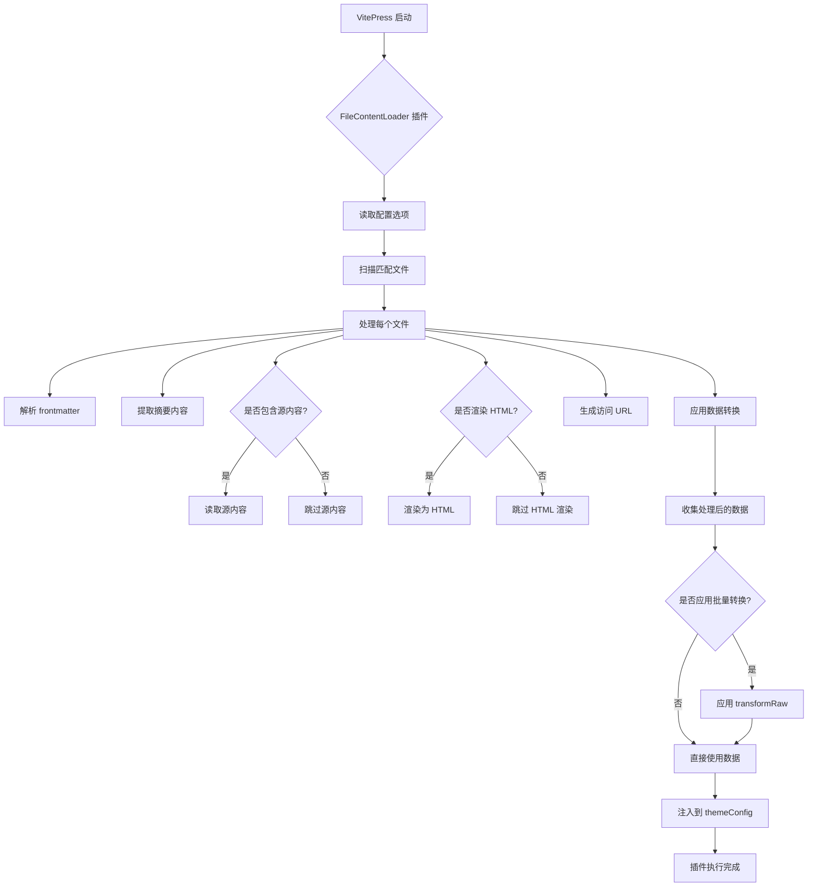

## 一、概述

`vitepress-plugin-file-content-loader` 是 [Teek](https://github.com/sumu-blog/vitepress-theme-teek) 主题生态系统中的一个重要插件，专门用于在 VitePress 项目构建时扫描和处理指定的文件内容。该插件将 VitePress 官方的[构建时数据加载](https://vitepress.dev/zh/guide/data-loading)功能封装成独立的插件形式，使开发者能够更便捷地获取和处理项目中的 Markdown 文件内容。

本文将围绕其设计思路、技术实现、配置选项以及与其他组件间的协作机制展开全面剖析。

## 二、基本功能

### 1. 文件内容扫描与处理

- 在 VitePress 启动时扫描项目中指定的文件（默认为 Markdown 文档）
- 解析文件的 frontmatter 元数据
- 提取文件摘要内容（excerpt）
- 可选地包含文件源内容和渲染后的 HTML 内容
- 生成文件对应的访问 URL 路径

### 2. 数据结构化与注入

- 将处理后的文件数据结构化为统一的数据格式
- 支持自定义数据转换函数，允许用户按需处理数据
- 将处理完成的数据注入到 VitePress 的 `themeConfig` 中
- 提供响应式数据访问接口，便于在组件中使用

### 3. 构建时处理机制

- 插件在构建时执行，不影响运行时性能
- 支持热重载，但在文件变更后需要重启项目才能生效
- 通过防重复执行机制确保在构建过程中只执行一次

## 三、配置项详解

### 1. 基本配置参数

插件支持多种配置选项，可根据实际需求进行灵活配置：

#### 1.1 `pattern`（必需）

文件路径匹配模式，支持 glob 表达式：

```typescript
// 单个模式
pattern: "**/*.md";

// 多个模式
pattern: ["docs/**/*.md", "guides/**/*.md"];
```

#### 1.2 `includeSrc`

是否包含文件的源内容，默认为 `false`：

```typescript
includeSrc: true; // 包含源内容
```

#### 1.3 `render`

是否将源内容渲染为 HTML，默认为 `false`：

```typescript
render: true; // 渲染为 HTML
```

注意：渲染 HTML 会增加内存消耗，建议谨慎使用。

#### 1.4 `excerpt`

是否解析和包含文件摘要，默认为 `false`：

```typescript
excerpt: true; // 使用默认分隔符 ---
excerpt: "---"; // 自定义分隔符
excerpt: (file, options) => {
  /* 自定义提取逻辑 */
};
```

#### 1.5 `themeConfigKey`

指定注入数据到 `themeConfig` 的键名，默认为 `"contentLoader"`：

```typescript
themeConfigKey: "articles"; // 注入到 themeConfig.articles
```

### 2. 高级配置选项

#### 2.1 `transformData` 数据转换函数

用于转换单条文件数据的回调函数：

```typescript
transformData: data => {
  // 只返回需要的字段，避免内存溢出
  return {
    url: data.url,
    title: data.frontmatter.title,
    date: data.frontmatter.date,
    excerpt: data.excerpt,
  };
};
```

#### 2.2 `transformRaw` 批量数据转换函数

用于转换所有文件数据的回调函数：

```typescript
transformRaw: raw => {
  // 按日期排序并过滤
  return raw
    .filter(item => item.frontmatter.published !== false)
    .sort((a, b) => new Date(b.frontmatter.date) - new Date(a.frontmatter.date));
};
```

#### 2.3 `globOptions`

传递给 `tinyglobby` 的配置选项：

```typescript
globOptions: {
  cwd: process.cwd(), // 当前工作目录
  absolute: false,     // 是否返回绝对路径
  // 更多选项...
}
```

### 3. 完整配置示例

```typescript
import { defineConfig } from "vitepress";
import FileContentLoader from "vitepress-plugin-file-content-loader";

export default defineConfig({
  vite: {
    plugins: [
      FileContentLoader({
        pattern: ["docs/**/*.md", "guides/**/*.md"],
        includeSrc: false,
        render: false,
        excerpt: true,
        transformData: data => {
          return {
            url: data.url,
            title: data.frontmatter.title,
            date: data.frontmatter.date,
            excerpt: data.excerpt,
          };
        },
        transformRaw: raw => {
          return raw.sort((a, b) => new Date(b.frontmatter.date) - new Date(a.frontmatter.date));
        },
        themeConfigKey: "articles",
      }),
    ],
  },
});
```

### 4. 数据访问方式

在 Vue 组件中通过 `useData` 获取处理后的数据：

```typescript
import { useData } from "vitepress";

const { theme } = useData();

// 获取处理后的数据
const articles = theme.value.articles; // 对应 themeConfigKey 配置
```

## 四、核心函数详解

### 1. 插件主函数 `VitePluginVitePressFileContentLoader`

#### 1.1 功能描述

这是插件的主入口函数，返回一个符合 Vite 插件规范的对象。该函数接收配置选项作为参数，并在 Vite 的 `config` 钩子中执行文件扫描和数据处理逻辑。

```typescript
export default function VitePluginVitePressFileContentLoader<T = FileContentLoaderData, R = FileContentLoaderData[]>(
  option: FileContentLoaderOptions<T, R>
): Plugin & { name: string };
```

#### 1.2 核心实现逻辑

```typescript
// 防止重复执行
let isExecute = false;

return {
  name: "vite-plugin-vitepress-file-content-loader",
  async config(config: any) {
    // 防止 vitepress build 时重复执行
    if (isExecute) return;
    isExecute = true;

    // 获取配置选项
    const { pattern, includeSrc = false, render = false /* ... */ } = option;

    // 扫描文件
    const mdFiles = await glob(pattern, {
      /* ... */
    });

    // 处理每个文件
    for (const file of mdFiles) {
      // 读取文件内容
      const src = readFileSync(file, "utf-8");

      // 解析 frontmatter 和摘要
      const { data: frontmatter, excerpt } = matter(src, {
        /* ... */
      });

      // 生成 URL
      const url = generateUrl(file, srcDir, cleanUrls);

      // 渲染 HTML（可选）
      const html = render ? md.render(src) : undefined;

      // 创建数据对象
      const data: FileContentLoaderData = {
        src: includeSrc ? src : undefined,
        html,
        frontmatter,
        excerpt: renderedExcerpt,
        url,
      };

      // 应用数据转换
      raw.push(transformData ? await transformData(data) : data);
    }

    // 注入到 themeConfig
    themeConfig[themeConfigKey] = transformRaw ? await transformRaw(raw) : raw;
  },
};
```

#### 1.3 关键实现细节

##### 文件扫描与匹配

插件使用 `tinyglobby` 进行高效的文件匹配：

```typescript
const mdFiles = (
  await glob(pattern, {
    expandDirectories: false,
    ...globOptions,
    ignore: ["**/node_modules/**", "**/dist/**", ...(globOptions?.ignore || [])],
  })
).sort();
```

##### Markdown 内容处理

使用 `gray-matter` 解析 Markdown 文件的 frontmatter 和摘要：

```typescript
const { data: frontmatter, excerpt } = matter(
  src,
  typeof renderExcerpt === "string" ? { excerpt_separator: renderExcerpt } : { excerpt: renderExcerpt }
);
```

##### URL 路径生成

根据 VitePress 的配置生成正确的访问 URL：

```typescript
const url =
  "/" +
  normalizePath(relative(srcDir, file))
    .replace(/(^|\/)index\.md$/, "$1")
    .replace(/\.md$/, cleanUrls ? "" : ".html");
```

##### HTML 渲染

使用 VitePress 的 Markdown 渲染器将源内容转换为 HTML：

```typescript
const md = await createMarkdownRenderer(srcDir, markdown, base, logger);
const html = render ? md.render(src) : undefined;
```

### 2. 数据结构定义

#### 2.1 `FileContentLoaderOptions` 配置选项接口

```typescript
export interface FileContentLoaderOptions<T = FileContentLoaderData, R = FileContentLoaderData[]> {
  pattern: string | string[];
  includeSrc?: boolean;
  render?: boolean;
  excerpt?:
    | boolean
    | ((file: { data: Record<string, any>; content: string; excerpt?: string }, options?: any) => void)
    | string;
  transformData?: (data: FileContentLoaderData) => T | Promise<T>;
  transformRaw?: (raw: (FileContentLoaderData | Awaited<T>)[]) => R | Promise<R>;
  globOptions?: GlobOptions;
  themeConfigKey?: string;
}
```

#### 2.2 `FileContentLoaderData` 数据结构接口

```typescript
export interface FileContentLoaderData {
  url: string; // 文件的访问 URL
  src?: string; // 文件的源内容（可选）
  html?: string; // 源内容转换后的 HTML（可选）
  frontmatter: Record<string, any>; // 文件的 frontmatter 数据
  excerpt?: string; // 文件摘要格式（可选）
}
```

## 五、依赖关系分析

### 1. 生产依赖

#### 1.1 `gray-matter`

用于解析 Markdown 文件的 frontmatter 和摘要内容。该库支持 YAML、JSON、CoffeeScript 等多种 frontmatter 格式。

#### 1.2 `picocolors`

用于在控制台输出带颜色的日志信息，提升开发体验。

#### 1.3 `tinyglobby`

用于高效的文件模式匹配，比原生 glob 库更快更轻量。

### 2. 开发依赖

#### 2.1 `vite`

作为插件运行的基础环境，插件遵循 Vite 插件规范。

#### 2.2 `vitepress`

作为插件的目标框架，插件专门为 VitePress 设计，并使用了 VitePress 提供的 API。

### 3. Peer Dependencies

#### 3.1 `vitepress`

插件需要与 VitePress 一起使用，因此将其声明为 peer dependency。

## 六、工作流程示意图



## 七、最佳实践与注意事项

### 1. 性能优化建议

#### 1.1 避免包含过多数据

```typescript
// 推荐：只包含必要字段
transformData: data => ({
  url: data.url,
  title: data.frontmatter.title,
  date: data.frontmatter.date,
  excerpt: data.excerpt,
});

// 不推荐：包含所有数据
transformData: data => data; // 可能导致内存溢出
```

#### 1.2 合理使用 HTML 渲染

```typescript
// 不推荐：默认关闭 HTML 渲染
render: false;

// 仅在确实需要时才开启
render: true; // 注意可能导致内存消耗增加
```

### 2. 文件组织建议

#### 2.1 使用精确的匹配模式

```typescript
// 推荐：使用具体的路径模式
pattern: ["docs/**/*.md", "guides/**/*.md"];

// 不推荐：过于宽泛的模式可能包含不需要的文件
pattern: "**/*.md";
```

### 3. 数据处理建议

#### 3.1 在 transformRaw 中进行批量处理

```typescript
transformRaw: raw => {
  return raw
    .filter(item => item.frontmatter.published !== false)
    .sort((a, b) => new Date(b.frontmatter.date) - new Date(a.frontmatter.date))
    .map(item => ({
      ...item,
      category: item.frontmatter.category || "未分类",
    }));
};
```

### 4. 注意事项

#### 4.1 热重载限制

插件在构建时执行，文件变更后需要重启项目才能生效：

```bash
# 修改文件后需要重启开发服务器
npm run dev
```

#### 4.2 内存使用

当处理大量文件或包含大段内容时，应注意内存使用情况，避免内存溢出。

## 八、结语

通过对 `vitepress-plugin-file-content-loader` 插件的深入分析，我们可以看到它是一个设计精良、功能完善的 VitePress 插件。它成功地将 VitePress 的构建时数据加载功能封装成易于使用的插件形式，为开发者提供了极大的便利。

该插件的核心优势在于：

1. **功能完整性**：涵盖了文件扫描、内容解析、数据转换等完整的功能链路
2. **性能优化**：采用构建时处理机制，不影响运行时性能
3. **灵活性**：丰富的配置选项和数据转换函数，满足不同场景需求
4. **易用性**：简洁的 API 设计和详细的文档说明

在未来的发展中，该插件还可以进一步优化，例如支持更多的文件格式、提供更丰富的数据处理选项等。但就目前而言，它已经能够很好地满足大部分项目的需求，是构建内容驱动型网站的重要工具。
