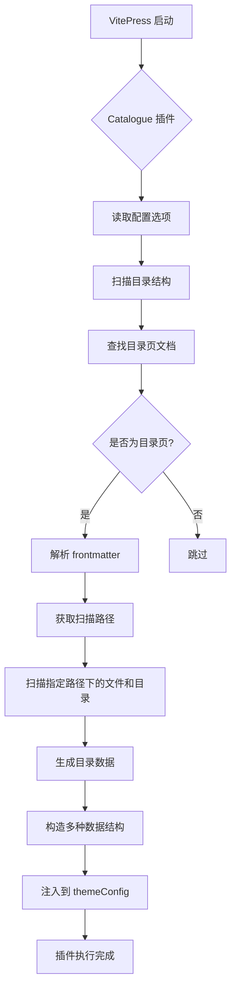

## 一、概述

`vitepress-plugin-catalogue` 是 [Teek](https://github.com/sumu-blog/vitepress-theme-teek) 主题生态系统中的一个重要插件，专门用于在 VitePress 项目构建时扫描 Markdown 文档并生成目录信息。该插件能够自动识别标记为目录页的文档，并为其生成结构化的目录数据，便于开发者创建美观实用的目录页面。

本文将围绕其设计思路、技术实现、配置选项以及与其他组件间的协作机制展开全面剖析。

## 二、基本功能

### 1. 目录数据自动生成

- 在 VitePress 启动时扫描项目中的 Markdown 文档
- 识别具有 `catalogue: true` 和 `path` 属性的文档作为目录页
- 根据指定路径扫描目录结构，生成层次化的目录数据
- 支持文件和文件夹的混合目录结构

### 2. 多种数据结构输出

- 生成三种不同形式的目录数据结构：数组形式、映射形式和反向映射形式
- 提供完整的类型定义，便于 TypeScript 项目使用
- 支持自定义数据处理函数，允许用户按需调整数据结构

### 3. 灵活的文件名解析

- 支持带序号的文件名解析（如 `01.introduction.md`）
- 支持自定义分隔符（如 `01_introduction.md`）
- 可从 Markdown 内容中提取标题作为目录项显示文本
- 支持忽略特定文件或目录

### 4. 构建时处理机制

- 插件在构建时执行，不影响运行时性能
- 支持热重载，但在文件变更后需要重启项目才能生效
- 通过防重复执行机制确保在构建过程中只执行一次

## 三、配置项详解

### 1. 基本配置参数

插件支持多种配置选项，可根据实际需求进行灵活配置：

#### 1.1 `ignoreList`

忽略的文件/文件夹列表，支持字符串和正则表达式：

```typescript
ignoreList: ["draft", "temp"]; // 忽略名为 draft 和 temp 的文件/文件夹
ignoreList: [/^draft-/]; // 忽略以 draft- 开头的文件/文件夹
```

#### 1.2 `path`

指定扫描的根目录，默认为 VitePress 的 `srcDir` 配置项：

```typescript
path: "docs"; // 扫描 docs 目录下的文件
```

#### 1.3 `ignoreIndexMd`

是否忽略每个目录下的 `index.md` 文件，默认为 `false`：

```typescript
ignoreIndexMd: true; // 忽略 index.md 文件
```

#### 1.4 `titleFormMd`

是否从 Markdown 文件获取第一个一级标题作为目录项文本，默认为 `false`：

```typescript
titleFormMd: true; // 从 Markdown 内容中提取标题
```

#### 1.5 `indexSeparator`

自定义序号后的分隔符，默认支持 `.` 作为分隔符：

```typescript
indexSeparator: "_"; // 支持 01_introduction.md 格式的文件名
```

#### 1.6 `catalogueItemResolved`

解析完每个目录项后的回调函数，可用于自定义处理目录项数据：

```typescript
catalogueItemResolved: data => {
  // 对目录项数据进行自定义处理
  return data.map(item => {
    // 添加自定义属性或其他处理
    return item;
  });
};
```

### 2. 使用示例

#### 2.1 基本配置

```typescript
import { defineConfig } from "vitepress";
import Catalogue from "vitepress-plugin-catalogue";

export default defineConfig({
  vite: {
    plugins: [
      Catalogue({
        path: "docs",
        ignoreList: ["draft", "temp"],
        ignoreIndexMd: true,
        titleFormMd: true,
      }),
    ],
  },
});
```

#### 2.2 目录页文档配置

在需要作为目录页的 Markdown 文档中添加以下 frontmatter：

```yaml
---
catalogue: true
path: guide # 指定要扫描生成目录的路径
---
```

#### 2.3 排除特定文档

在不想纳入目录的 Markdown 文档中添加以下 frontmatter：

```yaml
---
inCatalogue: false
---
```

### 3. 数据访问方式

在 Vue 组件中通过 `useData` 获取生成的目录数据：

```typescript
import { useData } from "vitepress";

const { theme } = useData();

// 获取目录数据
const catalogues = theme.value.catalogues;
```

## 四、核心函数详解

### 1. 插件主函数 `VitePluginVitePressCatalogue`

#### 1.1 功能描述

这是插件的主入口函数，返回一个符合 Vite 插件规范的对象。该函数接收配置选项作为参数，并在 Vite 的 `config` 钩子中执行目录数据生成逻辑。

```typescript
export default function VitePluginVitePressCatalogue(option: CatalogueOption = {}): Plugin & { name: string };
```

#### 1.2 核心实现逻辑

```typescript
let isExecute = false;

return {
  name: "vite-plugin-vitepress-catalogue",
  config(config: any) {
    // 防止 vitepress build 时重复执行
    if (isExecute) return;
    isExecute = true;

    // 获取 VitePress 配置
    const {
      site: { themeConfig },
      srcDir,
      rewrites,
      cleanUrls,
    } = config.vitepress;

    // 确定基础目录
    const baseDir = option.path ? join(srcDir, option.path) : srcDir;

    // 生成目录数据
    const catalogues = createCatalogues({ ...option, path: baseDir }, { rewrites: rewrites.map, cleanUrls });

    // 构造最终的目录数据结构
    const finalCatalogues: Catalogue = { arr: catalogues, map: {}, inv: {} };
    catalogues.forEach(item => {
      const { filePath, path, catalogues = [] } = item;
      const url = (removeMarkdownExt(rewrites.map[`${filePath}.md`]) || filePath) + (cleanUrls ? "" : ".html");

      finalCatalogues.map[filePath] = { url, path, catalogues };
      finalCatalogues.inv[path] = { url, filePath, catalogues };
    });

    // 注入到 themeConfig
    themeConfig.catalogues = finalCatalogues;

    logger.info("Injected Catalogues Data Successfully. 注入目录页数据成功!");
  },
};
```

### 2. 目录数据生成函数 `createCatalogues`

#### 2.1 功能描述

该函数是插件的核心实现，负责扫描指定目录并生成目录数据。

```typescript
export default (option: CatalogueOption = {}, vitepressConfig: VitePressConfig = {}) => {
  const { path = "", ignoreList = [] } = option;
  if (!path) return [];

  // 获取指定根目录下的所有目录绝对路径
  const dirPaths = readDirPaths(path, ignoreList);

  // 遍历根目录下的每个子目录
  dirPaths.forEach(dirPath => scannerMdFile(dirPath, option, basename(dirPath), vitepressConfig));

  return catalogueInfo;
};
```

#### 2.2 关键实现细节

##### 目录扫描

```typescript
const readDirPaths = (sourceDir: string, ignoreList: CatalogueOption["ignoreList"] = {}) => {
  const ignoreListAll = [...DEFAULT_IGNORE_DIR, ...ignoreList];
  const dirPaths: string[] = [];
  // 读取目录，返回数组，成员是 root 下所有的目录名（包含文件夹和文件，不递归）
  const dirOrFilenames = readdirSync(sourceDir);

  dirOrFilenames.forEach(dirOrFilename => {
    // 将路径或路径片段的序列解析为绝对路径，等于使用 cd 命令
    const secondDirPath = resolve(sourceDir, dirOrFilename);
    // 是否为文件夹目录，并排除指定文件夹
    if (!isSome(ignoreListAll, dirOrFilename) && statSync(secondDirPath).isDirectory()) {
      dirPaths.push(secondDirPath);
    }
  });

  return dirPaths;
};
```

##### Markdown 文件扫描

```typescript
const scannerMdFile = (root: string, option: CatalogueOption, prefix = "", vitepressConfig: VitePressConfig = {}) => {
  const { path: srcDir = "", ignoreList = [] } = option;
  const ignoreListAll = [...DEFAULT_IGNORE_DIR, ...ignoreList];
  // 读取目录名（文件和文件夹）
  const dirOrFilenames = readdirSync(root);

  dirOrFilenames.forEach(dirOrFilename => {
    if (isSome(ignoreListAll, dirOrFilename)) return [];

    const filePath = resolve(root, dirOrFilename);

    if (statSync(filePath).isDirectory()) {
      // 是文件夹目录
      scannerMdFile(filePath, option, `${prefix}/${dirOrFilename}`, vitepressConfig);
    } else {
      // 是文件
      if (!isMarkdownFile(dirOrFilename)) return;

      const content = readFileSync(filePath, "utf-8");
      // 解析出 frontmatter 数据
      const { data: { catalogue, path = "" } = {} } = matter(content, {});

      if (catalogue && path) {
        const filename = basename(dirOrFilename, extname(dirOrFilename));

        catalogueInfo.push({
          filePath: `${prefix}/${filename}`,
          path,
          catalogues: createCatalogueList(join(srcDir, path), option, `/${path}/`, vitepressConfig),
        });
      }
    }
  });
};
```

##### 目录列表生成

```typescript
const createCatalogueList = (
  root: string,
  option: CatalogueOption,
  prefix = "/",
  vitepressConfig: VitePressConfig = {}
): CatalogueItem[] => {
  if (!existsSync(root)) {
    console.warn(`'${root}' 路径不存在，将忽略该目录页的生成`);
    return [];
  }

  const { ignoreIndexMd = false, titleFormMd = false, indexSeparator, catalogueItemResolved } = option;

  const catalogueItemList: CatalogueItem[] = [];
  // 存放没有序号的目录页
  const catalogueItemListNoIndex: CatalogueItem[] = [];
  const dirOrFilenames = readdirSync(root);

  dirOrFilenames.forEach(dirOrFilename => {
    const fileAbsolutePath = resolve(root, dirOrFilename);
    const { index: indexStr, title, name } = resolveFileName(dirOrFilename, fileAbsolutePath, indexSeparator);
    const index = parseInt(indexStr as string, 10);

    if (statSync(fileAbsolutePath).isDirectory()) {
      // 是文件夹目录
      const mdTitle = titleFormMd ? tryGetMarkdownTitle(root, dirOrFilename) : "";

      const catalogueItem = {
        title: mdTitle || title,
        children: createCatalogueList(fileAbsolutePath, option, `${prefix}${dirOrFilename}/`, vitepressConfig),
        frontmatter: {},
      };

      if (isIllegalIndex(index)) catalogueItemListNoIndex.push(catalogueItem);
      else catalogueItemList[index] = catalogueItem;
    } else {
      // 是文件
      if (!isMarkdownFile(dirOrFilename)) return [];
      if (ignoreIndexMd && ["index.md", "index.MD"].includes(dirOrFilename)) return [];

      const content = readFileSync(fileAbsolutePath, "utf-8");
      // 解析出 frontmatter 数据
      const { data: frontmatter = {}, content: mdContent } = matter(content, {});
      const { title: frontmatterTitle, catalogue, inCatalogue = true } = frontmatter;

      // 不扫描目录页和 inCatalogue 为 false 的文档
      if (catalogue || !inCatalogue) return [];

      // title 获取顺序：md 文件 frontmatter.title > md 文件一级标题 > md 文件名
      const mdTitle = titleFormMd ? getTitleFromMarkdown(mdContent) : "";
      const finalTitle = frontmatterTitle || mdTitle || title;
      const filePath = prefix + name;

      const { rewrites = {}, cleanUrls } = vitepressConfig;

      const catalogueItem = {
        title: finalTitle,
        url:
          (removeMarkdownExt(rewrites[`${filePath.replace(/^\//, "")}.md`]) || filePath) + (cleanUrls ? "" : ".html"),
        frontmatter,
      };

      if (isIllegalIndex(index)) catalogueItemListNoIndex.push(catalogueItem);
      else catalogueItemList[index] = catalogueItem;
    }
  });

  // 将没有序号的 catalogueItemsNoIndex 放到最后面
  const data = [...catalogueItemList, ...catalogueItemListNoIndex].filter(Boolean);

  return catalogueItemResolved?.(data) ?? data;
};
```

### 3. 文件名解析函数

#### 3.1 `resolveFileName`

该函数负责解析文件名，提取序号、标题等信息：

```typescript
const resolveFileName = (filename: string, filePath: string, separator: string = ".") => {
  const stat = statSync(filePath);

  // 处理自定义分隔符
  if (separator !== "." && isExtraSeparator(filename, separator)) {
    return parseExtraSeparator(filename, stat.isDirectory(), separator);
  }

  // 处理点(.)分隔符
  if (filename.includes(".")) {
    return parseDotSeparator(filename, stat.isDirectory());
  }

  // 无分隔符情况
  return { index: "", title: filename, type: "", name: filename };
};
```

#### 3.2 `parseDotSeparator`

处理使用点(.)分隔符的文件名：

```typescript
const parseDotSeparator = (filename: string, isDirectory: boolean) => {
  const parts = filename.split(".");

  if (parts.length === 2) {
    // 简单情况：name.ext 或 index.md
    const index = parts[0] === "index" ? "0" : parts[0];
    const title = isDirectory ? parts[1] : parts[0];
    const type = isDirectory ? "" : parts[1];
    const name = parts[0];

    return { index, title, type, name };
  } else {
    // 复杂情况：01.name.ext
    const firstDotIndex = filename.indexOf(".");
    const lastDotIndex = filename.lastIndexOf(".");
    const index = filename.substring(0, firstDotIndex);

    // 对于文件，需要处理扩展名，对于目录，则不处理
    const title = filename.substring(firstDotIndex + 1, lastDotIndex);
    const type = isDirectory ? "" : filename.substring(lastDotIndex + 1);
    const name = isDirectory ? filename : filename.substring(0, lastDotIndex);

    return { index, title, type, name };
  }
};
```

## 五、依赖关系分析

### 1. 生产依赖

#### 1.1 `gray-matter`

用于解析 Markdown 文件的 frontmatter 内容。该库支持 YAML、JSON、CoffeeScript 等多种 frontmatter 格式。

#### 1.2 `picocolors`

用于在控制台输出带颜色的日志信息，提升开发体验。

### 2. 开发依赖

#### 2.1 `vite`

作为插件运行的基础环境，插件遵循 Vite 插件规范。

### 3. Node.js 内置模块

插件还使用了多个 Node.js 内置模块：

- `fs`: 用于文件系统操作，如读取文件内容、检查文件状态等
- `path`: 用于路径处理，如拼接路径、获取文件名等

## 六、数据结构定义

### 1. `CatalogueOption` 配置选项接口

```typescript
export interface CatalogueOption {
  /**
   * 忽略的文件/文件夹列表，支持正则表达式
   *
   * @default []
   */
  ignoreList?: Array<RegExp | string>;
  /**
   * 文章所在的目录，基于 .vitepress 目录层级添加
   *
   * @default 'vitepress 的 srcDir 配置项'
   */
  path?: string;
  /**
   * 是否忽略每个目录下的 index.md 文件
   *
   * @default false
   */
  ignoreIndexMd?: boolean;
  /**
   * 控制是否从 md 文件获取第一个一级标题作为侧边栏 text
   *
   * @default false
   * @remark 侧边栏 text 获取顺序
   * titleFormMd 为 true：md 文件 frontmatter.title > [md 文件第一个一级标题] > md 文件名
   * titleFormMd 为 false：md 文件 frontmatter.title > md 文件名
   */
  titleFormMd?: boolean;
  /**
   * 自定义序号后的分隔符（默认仍然支持 . 作为分隔符，该配置是支持额外分隔符，如自定义分隔符为 _，则文件名 01.a.md 和 01_a.md 都生效）
   */
  indexSeparator?: string;
  /**
   * 解析完每个 catalogueItem 后的回调。每个 catalogueItem 指的是每个目录下的文件数组
   *
   * @param data 当前 catalogueItem 列表
   */
  catalogueItemResolved?: (data: CatalogueItem[]) => CatalogueItem[];
}
```

### 2. `Catalogue` 目录数据接口

```typescript
export interface Catalogue {
  /**
   * 目录页数据，map 和 inv 都是由 arr 转换得来的
   */
  arr: CatalogueInfo[];
  /**
   * key 为文件相对路径，value 为 { path：扫描的目录页路径, url: "访问路径", catalogues：目录页数据 }
   */
  map: {
    [key: string]: { path: string; url: string; catalogues: CatalogueItem[] };
  };
  /**
   * key 为 path：扫描的目录页路径文，value 为 { path：件相对路径, url: "访问路径", catalogues：目录页数据 }
   */
  inv: {
    [key: string]: { filePath: string; url: string; catalogues: CatalogueItem[] };
  };
}
```

### 3. `CatalogueInfo` 目录信息接口

```typescript
export interface CatalogueInfo {
  /**
   * 文件相对路径
   */
  filePath: string;
  /**
   * 要扫描的目录路径
   */
  path: string;
  /**
   * 目录页数据
   */
  catalogues?: CatalogueItem[];
}
```

### 4. `CatalogueItem` 目录项接口

```typescript
export interface CatalogueItem {
  /**
   * 文件名称
   */
  title: string;
  /**
   * 文件 frontmatter
   */
  frontmatter: Record<string, any>;
  /**
   * 文件访问路径
   */
  url?: string;
  /**
   * 子目录
   */
  children?: CatalogueItem[];
}
```

## 七、工作流程示意图



## 八、最佳实践与注意事项

### 1. 文件组织建议

#### 1.1 合理命名文件

为了获得更好的目录排序效果，建议使用带序号的文件名：

```text
docs/
├── 01.introduction.md
├── 02.getting-started.md
├── 03.advanced/
│   ├── 01.configuration.md
│   └── 02.customization.md
└── 04.conclusion.md
```

#### 1.2 目录页文档配置

在需要作为目录页的文档中正确配置 frontmatter：

```yaml
---
catalogue: true
path: 03.advanced # 指定要扫描生成目录的路径
---
```

### 2. 配置优化建议

#### 2.1 合理使用 ignoreList

```typescript
Catalogue({
  ignoreList: [
    "draft", // 忽略草稿文件夹
    /\.tmp$/, // 忽略临时文件
    "private.md", // 忽略特定文件
  ],
});
```

#### 2.2 自定义分隔符

```typescript
Catalogue({
  indexSeparator: "_", // 支持 01_introduction.md 格式
});
```

### 3. 数据处理建议

#### 3.1 使用 catalogueItemResolved 自定义数据

```typescript
Catalogue({
  catalogueItemResolved: data => {
    // 为每个目录项添加图标属性
    return data.map(item => {
      return {
        ...item,
        icon: item.frontmatter.icon || "document",
      };
    });
  },
});
```

### 4. 注意事项

#### 4.1 热重载限制

插件在构建时执行，文件变更后需要重启项目才能生效：

```bash
# 修改文件后需要重启开发服务器
npm run dev
```

#### 4.2 路径配置

确保 `path` 配置指向正确的目录，避免路径错误导致无法生成目录数据。

#### 4.3 性能考虑

当目录结构非常复杂时，插件的扫描过程可能会消耗一定时间，建议合理组织目录结构。

## 九、结语

通过对 `vitepress-plugin-catalogue` 插件的深入分析，我们可以看到它是一个功能强大且设计精良的 VitePress 插件。它能够自动化生成目录数据，极大地简化了目录页面的开发工作。

该插件的核心优势在于：

1. **自动化程度高**：只需简单配置即可自动生成目录数据
2. **灵活性强**：支持多种配置选项，满足不同场景需求
3. **兼容性好**：支持自定义分隔符和多种文件命名方式
4. **易于集成**：生成的数据结构清晰，便于在 Vue 组件中使用

在未来的发展中，该插件还可以进一步优化，例如支持更多的自定义选项、提供更丰富的数据处理功能等。但就目前而言，它已经能够很好地满足大部分项目的需求，是构建结构化文档网站的重要工具。
