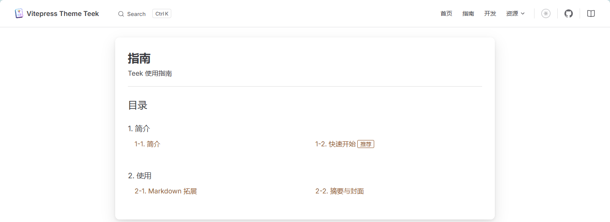
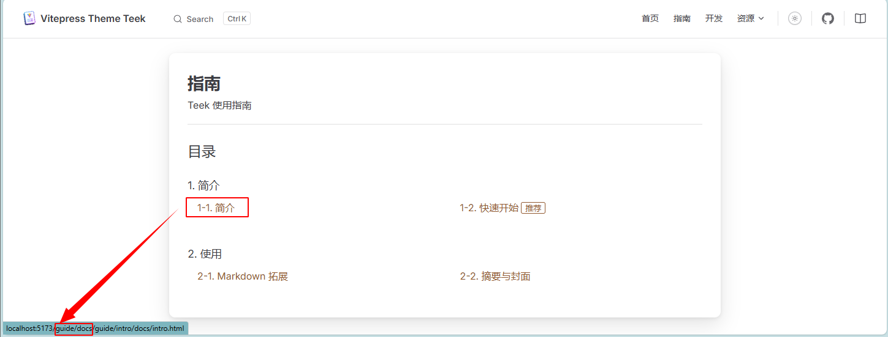
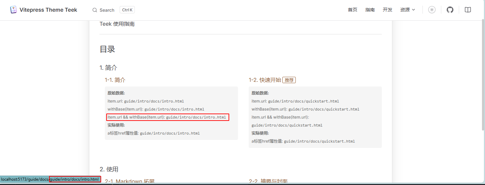
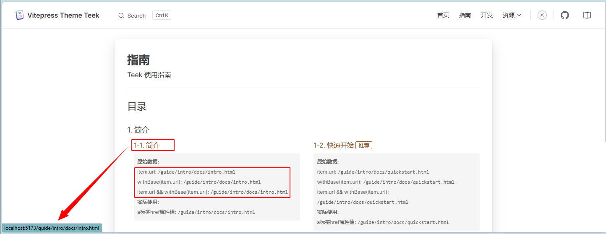

<!-- more -->

## 一、catalogue插件导入

在`vitepress-plugin-catalogue/src/index.ts`这样导入：

```typescript
export default function VitePluginVitePressCatalogue(option: CatalogueOption = {}): Plugin & { name: string } {
  let isExecute = false;

  return {
    name: "vite-plugin-vitepress-catalogue",
    //...
      const {
        site: { themeConfig },
        srcDir,
        rewrites,
        cleanUrls,
      } = config.vitepress;
      //...
      themeConfig.catalogues = finalCatalogues;
    },
  };
}
```

我们上面引入，然后得到的数据是这样的。包含map和inv两部分。

```typescript
{
  map: {
    '01.指南/01.简介/01.简介.md': 'guide/intro/docs/intro.md',
    '01.指南/01.简介/10.快速开始.md': 'guide/intro/docs/quickstart.md',
    '01.指南/10.使用/05.Markdown 拓展.md': 'guide/use/docs/markdown.md',
    '01.指南/10.使用/10.摘要与封面.md': 'guide/use/docs/summary.md',
    '01.指南/目录.md': 'guide/docs/catalog.md',
    '15.主题开发/01.开发思路.md': 'develop/docs/intro.md',
    '15.主题开发/10.主题配置.md': 'develop/docs/config.md',
    '20.资源/05.案例.md': 'resources/docs/case.md',
    '20.资源/10.功能拓展/01.简介.md': 'resources/expand/docs/intro.md',
    '20.资源/10.功能拓展/05.导航栏图标.md': 'resources/expand/docs/nav-icon.md',
    '@pages/archivesPage.md': 'archives.md',
    '@pages/articleOverviewPage.md': 'articleOverview.md',
    '@pages/categoriesPage.md': 'categories.md',
    '@pages/loginPage.md': 'login.md',
    '@pages/riskLinkPage.md': 'risk-link.md',
    '@pages/tagsPage.md': 'tags.md',
    'examples/articlePage/aside.md': 'iframe/articlePage/aside.md',
    'examples/articlePage/doc.md': 'iframe/articlePage/doc.md'
  },
  inv: {
    'guide/intro/docs/intro.md': '01.指南/01.简介/01.简介.md',
    'guide/intro/docs/quickstart.md': '01.指南/01.简介/10.快速开始.md',
    'guide/use/docs/markdown.md': '01.指南/10.使用/05.Markdown 拓展.md',
    'guide/use/docs/summary.md': '01.指南/10.使用/10.摘要与封面.md',
    'guide/docs/catalog.md': '01.指南/目录.md',
    'develop/docs/intro.md': '15.主题开发/01.开发思路.md',
    'develop/docs/config.md': '15.主题开发/10.主题配置.md',
    'resources/docs/case.md': '20.资源/05.案例.md',
    'resources/expand/docs/intro.md': '20.资源/10.功能拓展/01.简介.md',
    'resources/expand/docs/nav-icon.md': '20.资源/10.功能拓展/05.导航栏图标.md',
    'archives.md': '@pages/archivesPage.md',
    'articleOverview.md': '@pages/articleOverviewPage.md',
    'categories.md': '@pages/categoriesPage.md',
    'login.md': '@pages/loginPage.md',
    'risk-link.md': '@pages/riskLinkPage.md',
    'tags.md': '@pages/tagsPage.md',
    'iframe/articlePage/aside.md': 'examples/articlePage/aside.md',
    'iframe/articlePage/doc.md': 'examples/articlePage/doc.md'
  }
}
```

根据函数调用情况，后面使用的是map部分数据：

```typescript
const catalogues = createCatalogues({ ...option, path: baseDir }, { rewrites: rewrites.map, cleanUrls });
```

## 二、详细处理过程示例

为了更清楚地理解处理过程，我们以部分具体数据为例，详细描述每一步的处理过程。

### 1. 初始数据

要使用的的 rewrite 数据：

```json
{
  "01.指南/01.简介/01.简介.md": "guide/intro/docs/intro.md",
  "01.指南/01.简介/10.快速开始.md": "guide/intro/docs/quickstart.md",
  "01.指南/10.使用/05.Markdown 拓展.md": "guide/use/docs/markdown.md",
  "01.指南/10.使用/10.摘要与封面.md": "guide/use/docs/summary.md",
  "01.指南/目录.md": "guide/docs/catalog.md"
}
```

### 2. 第一步：扫描包含catalogue的md文件

`scannerMdFile` 函数会递归扫描指定目录下所有的 md 文件，查找包含 `catalogue` 和 `path` frontmatter 的文件。假设我们在 `01.指南/目录.md` 文件中添加了以下 frontmatter：

```markdown
---
catalogue: true
path: "guide/docs/catalog"
---

# 目录页

这是目录页内容...
```

当插件扫描到这个文件时，会执行以下操作：

1. 读取文件内容并解析 frontmatter
2. 检查是否存在 `catalogue` 和 `path` 字段
3. 如果存在，则调用 `createCatalogueList` 函数生成目录数据

### 3. 第二步：生成目录数据

`createCatalogueList` 函数会扫描指定路径下的文件和目录，生成目录数据：

```typescript
const createCatalogueList = (
  root: string,
  option: CatalogueOption,
  prefix = "/",
  vitepressConfig: VitePressConfig = {}
): CatalogueItem[] => {
  // ...
  dirOrFilenames.forEach(dirOrFilename => {
    // ...
    if (statSync(fileAbsolutePath).isDirectory()) {
      // 处理目录
    } else {
      // 处理文件
      if (!isMarkdownFile(dirOrFilename)) return [];
      if (ignoreIndexMd && ["index.md", "index.MD"].includes(dirOrFilename)) return [];

      const content = readFileSync(fileAbsolutePath, "utf-8");
      // 解析出 frontmatter 数据
      const { data: frontmatter = {}, content: mdContent } = matter(content, {});
      const { title: frontmatterTitle, catalogue, inCatalogue = true } = frontmatter;

      // 不扫描目录页和 inCatalogue 为 false 的文档
      if (catalogue || !inCatalogue) return [];

      // title 获取顺序：md 文件 frontmatter.title > md 文件一级标题 > md 文件名
      const mdTitle = titleFormMd ? getTitleFromMarkdown(mdContent) : "";
      const finalTitle = frontmatterTitle || mdTitle || title;
      const filePath = prefix + name;

      const { rewrites = {}, cleanUrls } = vitepressConfig;

      const catalogueItem = {
        title: finalTitle,
        url:
          (removeMarkdownExt(rewrites[`${filePath.replace(/^\//, "")}.md`]) || filePath) + (cleanUrls ? "" : ".html"),
        frontmatter,
      };

      if (isIllegalIndex(index)) catalogueItemListNoIndex.push(catalogueItem);
      else catalogueItemList[index] = catalogueItem;
    }
  });
  // ...
};
```

对于我们的示例数据，处理过程如下：

（1）扫描 `guide/docs/catalog` 目录下的文件

（2）处理 `01.简介.md` 文件：

- 解析文件名得到 index=1, title="简介"
- 读取文件内容，获取标题
- 查找 rewrites 映射中的 `01.指南/01.简介/01.简介.md` 键
- 找到对应的值 `guide/intro/docs/intro.md`
- 生成 URL：`/guide/intro/docs/intro.html`
- 创建目录项：{ title: "简介", url: "/guide/intro/docs/intro.html", frontmatter: {} }

（3）处理 `10.快速开始.md` 文件：

- 解析文件名得到 index=10, title="快速开始"
- 读取文件内容，获取标题
- 查找 rewrites 映射中的 `01.指南/01.简介/10.快速开始.md` 键
- 找到对应的值 `guide/intro/docs/quickstart.md`
- 生成 URL：`/guide/intro/docs/quickstart.html`
- 创建目录项：`{ title: "快速开始", url: "/guide/intro/docs/quickstart.html", frontmatter: {} }`

（4）处理 `05.Markdown 拓展.md` 文件：

- 解析文件名得到 index=5, title="Markdown 拓展"
- 读取文件内容，获取标题
- 查找 rewrites 映射中的 `01.指南/10.使用/05.Markdown 拓展.md` 键
- 找到对应的值 `guide/use/docs/markdown.md`
- 生成 URL：`/guide/use/docs/markdown.html`
- 创建目录项：`{ title: "Markdown 拓展", url: "/guide/use/docs/markdown.html", frontmatter: {} }`

（5）处理 `10.摘要与封面.md` 文件：

- 解析文件名得到 index=10, title="摘要与封面"
- 读取文件内容，获取标题
- 查找 rewrites 映射中的 `01.指南/10.使用/10.摘要与封面.md` 键
- 找到对应的值 `guide/use/docs/summary.md`
- 生成 URL：`/guide/use/docs/summary.html`
- 创建目录项：`{ title: "摘要与封面", url: "/guide/use/docs/summary.html", frontmatter: {} }`

### 4. 第三步：合并和排序目录项

将处理好的项按索引排序：

（1）"01.简介.md" 文件项 (index=1)

（2）"10.快速开始.md" 文件项 (index=10)

最终生成的目录数据：

```json
[
  {
    "title": "简介",
    "url": "/guide/intro/docs/intro.html",
    "frontmatter": {}
  },
  {
    "title": "快速开始",
    "url": "/guide/intro/docs/quickstart.html",
    "frontmatter": {}
  }
]
```

## 三、示例：生成最终的目录数据结构

基于提供的 rewrites 数据，最终生成的目录数据结构如下：

```json
{
  "arr": [
    {
      "filePath": "/guide/intro/docs/intro",
      "path": "guide/intro/docs/intro",
      "catalogues": [
        {
          "title": "简介",
          "url": "/guide/intro/docs/intro.html",
          "frontmatter": {}
        },
        {
          "title": "快速开始",
          "url": "/guide/intro/docs/quickstart.html",
          "frontmatter": {}
        }
      ]
    },
    {
      "filePath": "/guide/use/docs/markdown",
      "path": "guide/use/docs/markdown",
      "catalogues": [
        {
          "title": "Markdown 拓展",
          "url": "/guide/use/docs/markdown.html",
          "frontmatter": {}
        },
        {
          "title": "摘要与封面",
          "url": "/guide/use/docs/summary.html",
          "frontmatter": {}
        }
      ]
    },
    {
      "filePath": "/guide/docs/catalog",
      "path": "guide/docs/catalog",
      "catalogues": [
        {
          "title": "简介",
          "url": "/guide/intro/docs/intro.html",
          "frontmatter": {}
        },
        {
          "title": "快速开始",
          "url": "/guide/intro/docs/quickstart.html",
          "frontmatter": {}
        },
        {
          "title": "Markdown 拓展",
          "url": "/guide/use/docs/markdown.html",
          "frontmatter": {}
        },
        {
          "title": "摘要与封面",
          "url": "/guide/use/docs/summary.html",
          "frontmatter": {}
        }
      ]
    }
  ],
  "map": {
    "/guide/intro/docs/intro": {
      "url": "/guide/intro/docs/intro.html",
      "path": "guide/intro/docs/intro",
      "catalogues": [
        {
          "title": "简介",
          "url": "/guide/intro/docs/intro.html",
          "frontmatter": {}
        },
        {
          "title": "快速开始",
          "url": "/guide/intro/docs/quickstart.html",
          "frontmatter": {}
        }
      ]
    },
    "/guide/use/docs/markdown": {
      "url": "/guide/use/docs/markdown.html",
      "path": "guide/use/docs/markdown",
      "catalogues": [
        {
          "title": "Markdown 拓展",
          "url": "/guide/use/docs/markdown.html",
          "frontmatter": {}
        },
        {
          "title": "摘要与封面",
          "url": "/guide/use/docs/summary.html",
          "frontmatter": {}
        }
      ]
    },
    "/guide/docs/catalog": {
      "url": "/guide/docs/catalog.html",
      "path": "guide/docs/catalog",
      "catalogues": [
        {
          "title": "简介",
          "url": "/guide/intro/docs/intro.html",
          "frontmatter": {}
        },
        {
          "title": "快速开始",
          "url": "/guide/intro/docs/quickstart.html",
          "frontmatter": {}
        },
        {
          "title": "Markdown 拓展",
          "url": "/guide/use/docs/markdown.html",
          "frontmatter": {}
        },
        {
          "title": "摘要与封面",
          "url": "/guide/use/docs/summary.html",
          "frontmatter": {}
        }
      ]
    }
  },
  "inv": {
    "guide/intro/docs/intro": {
      "url": "/guide/intro/docs/intro.html",
      "filePath": "/guide/intro/docs/intro",
      "catalogues": [
        {
          "title": "简介",
          "url": "/guide/intro/docs/intro.html",
          "frontmatter": {}
        },
        {
          "title": "快速开始",
          "url": "/guide/intro/docs/quickstart.html",
          "frontmatter": {}
        }
      ]
    },
    "guide/use/docs/markdown": {
      "url": "/guide/use/docs/markdown.html",
      "filePath": "/guide/use/docs/markdown",
      "catalogues": [
        {
          "title": "Markdown 拓展",
          "url": "/guide/use/docs/markdown.html",
          "frontmatter": {}
        },
        {
          "title": "摘要与封面",
          "url": "/guide/use/docs/summary.html",
          "frontmatter": {}
        }
      ]
    },
    "guide/docs/catalog": {
      "url": "/guide/docs/catalog.html",
      "filePath": "/guide/docs/catalog",
      "catalogues": [
        {
          "title": "简介",
          "url": "/guide/intro/docs/intro.html",
          "frontmatter": {}
        },
        {
          "title": "快速开始",
          "url": "/guide/intro/docs/quickstart.html",
          "frontmatter": {}
        },
        {
          "title": "Markdown 拓展",
          "url": "/guide/use/docs/markdown.html",
          "frontmatter": {}
        },
        {
          "title": "摘要与封面",
          "url": "/guide/use/docs/summary.html",
          "frontmatter": {}
        }
      ]
    }
  }
}
```

**注意**：

（1）目录项按照文件名中的序号进行排序（01, 05, 10...）

（2）URL路径通过rewrites映射生成

（3）catalogues数组包含指定路径下的所有文档项

## 四、CataloguePage

`CataloguePage` 组件用于展示目录页面。它会根据 Markdown 文件中的 `catalogue` 和 `path` frontmatter 生成目录数据，并将这些数据注入到 VitePress 的主题配置中。组件通过读取这些数据来渲染目录项，并为每个项生成跳转链接。

### 1. 数据使用

`CataloguePage` 组件通过以下方式使用目录数据：

（1）**获取数据**：组件使用 `useData()` 钩子获取 `theme` 和 `frontmatter` 对象。然后，它通过 `theme.value.catalogues?.inv[frontmatter.value.path]?.catalogues` 获取当前页面的目录数据。

（2）**渲染目录项**：组件使用 `v-for` 指令遍历 `catalogues` 数组，并为每个项目渲染一个 `CatalogueItem` 组件。

### 2. 跳转链接组成

跳转链接的组成过程如下：

（1）**URL 生成**：在 `vitepress-plugin-catalogue` 插件中，当扫描目录下的文件时，会根据 VitePress 的 `rewrites` 配置生成 URL。具体逻辑在 plugins\vitepress-plugin-catalogue\src\helper.ts文件：

```typescript
url:
  (removeMarkdownExt(rewrites[`${filePath.replace(/^\//, "")}.md`]) || filePath) + (cleanUrls ? "" : ".html"),
```

这里，`filePath` 是文件的路径（相对于源目录），`rewrites` 是从 VitePress 配置中获取的重写映射。它会查找 `rewrites` 中是否存在对应文件的映射，如果存在，则使用映射后的路径作为 URL，否则使用原始路径。最后，根据 `cleanUrls` 配置决定是否添加 `.html` 后缀。

（2）**链接渲染**：在 `CatalogueItem` 组件中，对于非目录项（即具体的文档项），它会渲染一个 `<a>` 标签。

```vue
<a v-if="!item.children" :href="item.url && withBase(item.url)" :aria-label="`${index}. ${item.title}`">
  {{ index }}.
  <span v-html="item.title" />
  <!-- ... -->
</a>
```

`:href="item.url && withBase(item.url)"` 这行代码将 `item.url` 作为跳转链接。`withBase` 是 VitePress 提供的函数，用于将相对路径转换为带 base 路径的绝对路径。

### 3. 实例

假设我们的网站部署在 `http://localhost:5173/`，并且有以下目录结构和 rewrites 配置：

```bash
docs
├── 01.指南
│   ├── 目录.md
│   ├── 01.简介
│   │   ├── 01.简介.md
│   │   └── 10.快速开始.md
│   └── 10.使用
│       ├── 05.Markdown 拓展.md
│       └── 10.摘要与封面.md
```

```typescript
// rewrites 配置
{
  "01.指南/目录.md": "guide/docs/catalog.md",
  "01.指南/01.简介/01.简介.md": "guide/intro/docs/intro.md",
  "01.指南/01.简介/10.快速开始.md": "guide/intro/docs/quickstart.md",
  "01.指南/10.使用/05.Markdown 拓展.md": "guide/use/docs/markdown.md",
  "01.指南/10.使用/10.摘要与封面.md": "guide/use/docs/summary.md"
}
```

在 `docs/01.指南/目录.md` 文件中，我们添加了以下 frontmatter：

```markdown
---
catalogue: true
path: "guide/docs/catalog"
---
```

**数据生成**：插件会扫描 `guide/docs/catalog` 目录，并为其中的文件生成目录数据。例如，对于 `01.简介.md` 文件，它会执行以下步骤来生成 URL：

（1）获取文件的相对路径：`01.指南/01.简介/01.简介.md`。
（2）在 `rewrites` 配置中查找映射：找到 `"01.指南/01.简介/01.简介.md": "guide/intro/docs/intro.md"`。
（3）生成相对 URL：`/guide/intro/docs/intro.md`。
（4）移除 Markdown 扩展名：`/guide/intro/docs/intro`。
（5）根据 `cleanUrls` 配置添加 `.html` 后缀（假设 `cleanUrls` 为 `false`）：`/guide/intro/docs/intro.html`。

最终生成的数据如下：

```json
{
  "title": "简介",
  "url": "/guide/intro/docs/intro.html",
  "frontmatter": {}
}
```

**组件渲染与链接生成**：`CataloguePage` 组件获取到这些数据后，会渲染出一个链接。在 `CatalogueItem` 组件中，链接通过 `:href="item.url && withBase(item.url)"` 生成。`withBase` 函数会将相对路径转换为带 base 路径的绝对路径。

假设 VitePress 的 `base` 配置为 `/`，那么 `withBase("/guide/intro/docs/intro.html")` 会返回 `/guide/intro/docs/intro.html`。

最终生成的 HTML 链接如下：

```html
<a href="/guide/intro/docs/intro.html" aria-label="1. 简介">
  1.
  <span>简介</span>
</a>
```

当用户访问 `http://localhost:5173/guide/docs/catalog.html` 页面时，点击这个链接将会跳转到 `http://localhost:5173/guide/intro/docs/intro.html`。

通过这种方式，`CataloguePage` 组件能够动态地根据目录结构和 rewrites 配置生成跳转链接，为用户提供便捷的导航。

## 五、问题分析

按照上面的数据，产生了一个问题，就是，上面我们可以得到这样的一个目录页：



根据前面的目录数据的生成，这个数据是对的，但是将会得到这样的跳转链接：



这里多了一段，原本跳转链接应该是 `http://localhost:5173/guide/intro/docs/intro.html`才对，我们加点打印信息在`packages/components/theme/CataloguePage/src/CatalogueItem.vue`中：

```vue
   <a v-if="!item.children" :href="item.url && withBase(item.url)" :aria-label="`${index}. ${item.title}`">
      {{ index }}.
      <span v-html="item.title" />
      <TkTitleTag
        v-if="item.frontmatter?.titleTag"
        :text="item.frontmatter?.titleTag"
        position="right"
        size="small"
        :aria-label="item.frontmatter?.titleTag"
      />
    </a>

    <!-- 调试信息 -->
    <div v-if="!item.children" style="margin-top: 8px; font-size: 12px; color: #666; background: #f5f5f5; padding: 8px; border-radius: 4px;">
      <div><strong>原始数据:</strong></div>
      <div>item.url: <code>{{ item.url }}</code></div>
      <div>withBase(item.url): <code>{{ withBase(item.url) }}</code></div>
      <div>item.url && withBase(item.url): <code>{{ item.url && withBase(item.url) }}</code></div>
      <div><strong>实际使用:</strong></div>
      <div>a标签href属性值: <code>{{ item.url && withBase(item.url) }}</code></div>
    </div>
```

然后就会发现：



得到路径是正常的，但是多添加了当前路径，因为目录页刚好就在`http://localhost:5173/guide/docs/catalog.html`，这又是为什么？这个其实我并没有找到原因，但是有种方案就是，生成目录页链接时直接用绝对路径，例如，修改`vitepress-plugin-catalogue/src/helper.ts`中

```typescript
const createCatalogueList = (
  root: string,
  option: CatalogueOption,
  prefix = "/",
  vitepressConfig: VitePressConfig = {}
): CatalogueItem[] => {
  if (!existsSync(root)) {
    console.warn(`'${root}' 路径不存在，将忽略该目录页的生成`);
    return [];
  }

  //...
      const catalogueItem = {
        title: finalTitle,
        url:
          "/" + (removeMarkdownExt(rewrites[`${filePath.replace(/^\//, "")}.md`]) || filePath.replace(/^\//, "")) + (cleanUrls ? "" : ".html"),
        frontmatter,
      };

      if (isIllegalIndex(index)) catalogueItemListNoIndex.push(catalogueItem);
      else catalogueItemList[index] = catalogueItem;
    }
  });
  //...
  return catalogueItemResolved?.(data) ?? data;
};
```

在生成catalogueItem的时候直接加上/的绝对路径，这个时候就正常了：



反正到最后也不是很理解为什么，后面有机会搞明白了再补充。
